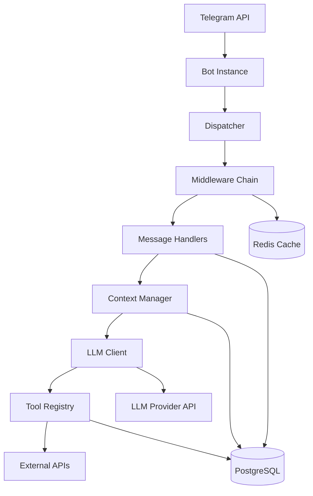

# Gryag 2.0 - AI Telegram Bot

[](https://www.python.org/downloads/)
[](https://opensource.org/licenses/MIT)
[](https://www.docker.com/)

A comprehensive, dockerized Telegram bot with advanced context management, LLM integration, tool calling, and multimodality.

## Features

### Core Capabilities

- **Multi-Chat Support**: Works seamlessly in private chats and groups
- **Advanced Context Management**: Multi-layered context system with immediate history, summaries, and user memories
- **Tool Calling**: Extensible tool system (calculator, weather, search, image generation, memory management)
- **User Memory**: Persistent facts about users across all chats
- **Admin Controls**: Comprehensive admin commands for user management and access control
- **Multimodal**: Image recognition and generation support
- **Rate Limiting**: Configurable rate limiting to prevent abuse
- **Access Control**: Flexible access modes (global, private, whitelist)

### Technical Features

- **OpenAI-Compatible API**: Works with any OpenAI-compatible LLM provider
- **PostgreSQL Database**: Persistent storage for messages, users, and context
- **Redis Caching**: Optional Redis integration for performance
- **Background Tasks**: Automated summarization and maintenance
- **Docker Deployment**: Fully containerized for easy deployment
- **Comprehensive Logging**: Structured logging with file rotation

## Quick Start

### Prerequisites

- Docker and Docker Compose
- Telegram bot token from [@BotFather](https://t.me/BotFather)
- LLM API key (OpenAI or compatible provider)

### Installation

1. **Clone the repository:**

   ```bash
   git clone https://github.com/yourserver/gryag-2.0.git
   cd gryag-2.0
   ```

2. **Create environment file:**

   ```bash
   cp .env.example .env
   # Edit .env with your credentials
   ```

3. **Start services:**

   ```bash
   docker compose up -d
   ```

4. **Check logs:**

   ```bash
   docker compose logs -f bot
   ```

5. **Verify bot is running:**

   ```bash
   docker compose ps
   ```

## Architecture Overview



### Key Components

- **Handlers**: Process incoming messages (private and group chats)
- **Context Manager**: Assembles context from multiple sources (system prompt, summaries, immediate history, memories)
- **LLM Client**: OpenAI-compatible client with retry logic and fallback support
- **Tool Registry**: Manages and executes tools (calculator, weather, search, etc.)
- **Repositories**: Database access layer using repository pattern
- **Middlewares**: Access control, rate limiting, and logging

See [Architecture Documentation](docs/en/architecture.md) for detailed information.

## Configuration

The bot is configured via environment variables. Key settings:

```env
# Required
TELEGRAM_BOT_TOKEN=your_token_here
LLM_API_KEY=your_api_key_here

# Optional
ADMIN_IDS=12345678,87654321
ACCESS_MODE=global
LLM_MODEL=gpt-4o
```

See [Configuration Guide](docs/en/configuration.md) for all available options.

## Documentation

### English Documentation

- **[Architecture](docs/en/architecture.md)** - System architecture and design
- **[Configuration](docs/en/configuration.md)** - Complete configuration reference
- **[Deployment](docs/en/deployment.md)** - Deployment guide and best practices
- **[Tools](docs/en/tools.md)** - Tool system and development guide
- **[Context Management](docs/en/context-management.md)** - Context system deep-dive
- **[Database Schema](docs/en/database.md)** - Database documentation
- **[Admin Guide](docs/en/admin.md)** - Admin commands and access control
- **[API Reference](docs/en/api-reference.md)** - Code-level API documentation
- **[Development Guide](docs/en/development.md)** - Development setup and guidelines
- **[Troubleshooting](docs/en/troubleshooting.md)** - Common issues and solutions

### Ukrainian Documentation (Українська документація)

- **[Архітектура](docs/uk/architecture.md)** - Архітектура системи та дизайн
- **[Конфігурація](docs/uk/configuration.md)** - Повний довідник конфігурації
- **[Розгортання](docs/uk/deployment.md)** - Посібник з розгортання та найкращі практики
- **[Інструменти](docs/uk/tools.md)** - Система інструментів та посібник з розробки
- **[Керування контекстом](docs/uk/context-management.md)** - Поглиблений розгляд системи контексту
- **[Схема бази даних](docs/uk/database.md)** - Документація бази даних
- **[Посібник адміністратора](docs/uk/admin.md)** - Адмін-команди та контроль доступу
- **[API Reference](docs/uk/api-reference.md)** - Документація API на рівні коду
- **[Посібник з розробки](docs/uk/development.md)** - Налаштування середовища розробки та керівні принципи
- **[Усунення проблем](docs/uk/troubleshooting.md)** - Загальні проблеми та рішення
- **[Системні промпти](docs/uk/prompts.md)** - Налаштування промптів

## Available Tools

The bot includes several built-in tools:

1. **Calculator** - Safe mathematical expression evaluation
2. **Weather** - Current weather information via Open-Meteo
3. **Web Search** - Web search via DuckDuckGo
4. **Image Generation** - DALL-E 3 image generation
5. **Save User Fact** - Store user facts persistently
6. **Get User Facts** - Retrieve user memories

See [Tools Documentation](docs/en/tools.md) for details and development guide.

## Context Management

The bot uses a sophisticated multi-layered context system:

1. **System Prompt** - Base instructions with variable substitution
2. **Summaries** - 7-day and 30-day conversation summaries
3. **Immediate Context** - Last N messages (default: 100)
4. **User Memories** - Persistent facts about users
5. **Visual Context** - Image URLs when replying to photos

See [Context Management Documentation](docs/en/context-management.md) for details.

## Admin Commands

Admins can use commands in private chats:

- `/status` - Bot status and configuration
- `/config` - LLM and context configuration
- `/ban <user_id>` - Ban a user
- `/unban <user_id>` - Unban a user
- `/restrict <user_id> <hours>` - Temporarily restrict a user
- `/whitelist add|remove <chat_id>` - Manage whitelist
- `/blacklist add|remove <user_id>` - Manage blacklist

See [Admin Guide](docs/en/admin.md) for complete documentation.

## Development

### Setup Development Environment

```bash
# Create virtual environment
python -m venv venv
source venv/bin/activate  # On Windows: venv\Scripts\activate

# Install dependencies
pip install -e ".[dev]"

# Start services
docker compose up -d postgres redis

# Run bot
python -m bot.main
```

### Running Tests

```bash
# Run all tests
pytest

# Run with coverage
pytest --cov=bot --cov-report=html
```

See [Development Guide](docs/en/development.md) for complete setup instructions.

## Contributing

Contributions are welcome! Please read [CONTRIBUTING.md](CONTRIBUTING.md) for guidelines.

### Quick Contribution Guide

1. Fork the repository
2. Create a feature branch (`git checkout -b feature/amazing-feature`)
3. Make your changes
4. Write or update tests
5. Ensure tests pass (`pytest`)
6. Format code (`ruff format .`)
7. Commit changes (`git commit -m 'Add amazing feature'`)
8. Push to branch (`git push origin feature/amazing-feature`)
9. Open a Pull Request

## Project Structure

```
gryag-2.0/
├── bot/                    # Main application code
│   ├── handlers/          # Message handlers
│   ├── context/           # Context management
│   ├── db/                # Database layer
│   ├── llm/               # LLM client
│   ├── tools/             # Tool system
│   └── middlewares/       # Middleware
├── tests/                 # Tests
├── migrations/            # Database migrations
├── prompts/               # System prompts
└── docs/                  # Documentation
```

## License

This project is licensed under the MIT License - see the LICENSE file for details.

## Support

- **Documentation**: See [docs/en/](docs/en/) directory
- **Issues**: Report bugs or request features via GitHub Issues
- **Troubleshooting**: See [Troubleshooting Guide](docs/en/troubleshooting.md)

## Acknowledgments

- Built with [aiogram](https://github.com/aiogram/aiogram) - Modern async Telegram Bot framework
- Uses [SQLAlchemy](https://www.sqlalchemy.org/) - Python SQL toolkit
- Powered by OpenAI-compatible LLM APIs
