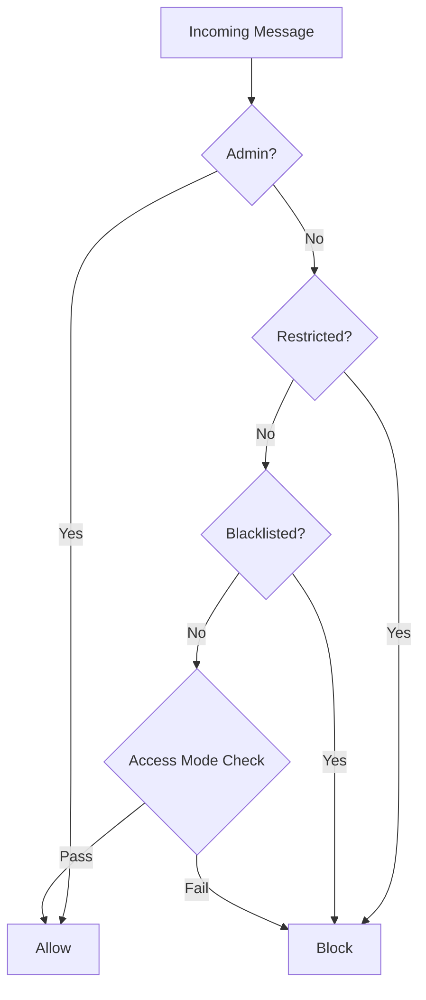

# Admin Guide

This guide covers admin commands, access control configuration, and user management for Gryag 2.0.

## Admin Setup

### Setting Admin Users

Admins are configured via the `ADMIN_IDS` environment variable:

```env
ADMIN_IDS=12345678,87654321,11111111
```

**Getting Your User ID:**

1. Send a message to [@userinfobot](https://t.me/userinfobot) on Telegram
2. The bot will reply with your user ID
3. Add your user ID to `ADMIN_IDS` in `.env`
4. Restart the bot

**Note:** Admin commands only work in private chats with the bot.

## Admin Commands

All admin commands must be sent in a private chat with the bot.

### `/status`

Display bot status and configuration.

**Usage:**
```
/status
```

**Output:**
- Bot uptime
- Access mode
- LLM model
- Feature flags (reasoning, structured output, etc.)
- Rate limit settings
- Admin count
- Whitelist/blacklist counts

**Example:**
```
📊 Статус бота

⏱ Uptime: 2d 5h 30m
Режим доступу: global
LLM модель: gpt-4o
Reasoning: ✅
Structured output: ✅
Rate limit: 30/год
Модерація: ❌
Typing indicator: ✅

Адміни: 2
Whitelist чати: 0
Blacklist юзери: 0
```

### `/config`

Display current LLM and context configuration.

**Usage:**
```
/config
```

**Output:**
- LLM base URL
- Primary model
- Vision model
- Summarization model
- Timeout and retry settings
- Token limits
- Context settings

**Example:**
```
⚙️ Конфігурація

LLM Base URL: https://api.openai.com/v1
Model: gpt-4o
Vision: gpt-4o
Summarization: gpt-4o-mini

Timeout: 60s
Max retries: 3
Max tokens: 2048

Immediate context: 100 msgs
Context limit: 8000 tokens
Memory limit: 50/user
```

### `/ban`

Permanently ban a user from using the bot.

**Usage:**
```
/ban <user_id> [reason]
```

**Parameters:**
- `user_id` (required): Telegram user ID to ban
- `reason` (optional): Reason for ban

**Example:**
```
/ban 12345678 Spam and harassment
```

**Effects:**
- User cannot interact with bot
- Ban is permanent (no expiration)
- Stored in database
- Can be removed with `/unban`

### `/unban`

Remove a user's ban.

**Usage:**
```
/unban <user_id>
```

**Parameters:**
- `user_id` (required): Telegram user ID to unban

**Example:**
```
/unban 12345678
```

**Effects:**
- Removes active ban
- User can interact with bot again

### `/restrict`

Temporarily restrict a user.

**Usage:**
```
/restrict <user_id> <hours> [reason]
```

**Parameters:**
- `user_id` (required): Telegram user ID to restrict
- `hours` (required): Number of hours to restrict
- `reason` (optional): Reason for restriction

**Example:**
```
/restrict 12345678 24 Excessive requests
```

**Effects:**
- User cannot interact with bot
- Restriction expires after specified hours
- Automatically removed when expired

### `/whitelist`

Manage chat whitelist (when `ACCESS_MODE=whitelist`).

**Usage:**
```
/whitelist add <chat_id>
/whitelist remove <chat_id>
```

**Parameters:**
- `add|remove` (required): Action to perform
- `chat_id` (required): Telegram chat ID

**Getting Chat ID:**
- For groups: Add [@userinfobot](https://t.me/userinfobot) to group
- For private chats: Your user ID is the chat ID

**Example:**
```
/whitelist add -1001234567890
/whitelist remove -1001234567890
```

**Effects:**
- `add`: Chat can use bot (if `ACCESS_MODE=whitelist`)
- `remove`: Chat removed from whitelist

### `/blacklist`

Manage user blacklist.

**Usage:**
```
/blacklist add <user_id>
/blacklist remove <user_id>
```

**Parameters:**
- `add|remove` (required): Action to perform
- `user_id` (required): Telegram user ID

**Example:**
```
/blacklist add 12345678
/blacklist remove 12345678
```

**Effects:**
- `add`: User cannot interact with bot
- `remove`: User removed from blacklist

**Note:** Blacklist is separate from bans. Blacklist is checked before bans.

### `/reload_prompt`

Verify system prompt file is accessible.

**Usage:**
```
/reload_prompt
```

**Output:**
- Confirmation that prompt file exists
- Warning if file not found

**Note:** Prompts are loaded on-demand, so this just verifies file existence.

## Access Control

### Access Modes

The bot supports three access modes:

#### 1. Global (`ACCESS_MODE=global`)

**Default mode.** Bot responds in all chats.

- All private chats allowed
- All groups allowed (with trigger keywords)
- No restrictions

**Configuration:**
```env
ACCESS_MODE=global
```

#### 2. Private (`ACCESS_MODE=private`)

Bot only responds in private chats.

- Private chats allowed
- Groups blocked
- Useful for testing or personal use

**Configuration:**
```env
ACCESS_MODE=private
```

#### 3. Whitelist (`ACCESS_MODE=whitelist`)

Bot only responds in whitelisted chats and private chats.

- Private chats always allowed
- Only whitelisted groups allowed
- Use `/whitelist` command to manage

**Configuration:**
```env
ACCESS_MODE=whitelist
WHITELIST_CHATS=-1001234567890,-1009876543210
```

**Managing Whitelist:**

1. **Via Command:**
   ```
   /whitelist add -1001234567890
   ```

2. **Via Environment:**
   ```env
   WHITELIST_CHATS=-1001234567890,-1009876543210
   ```

3. **Via Database:**
   - Entries in `access_list` table
   - `entity_type="chat"`, `list_type="whitelist"`

### Access Control Layers

Access control is checked in this order:



1. **Admin Bypass:** Admins skip all checks
2. **Restriction Check:** Bans and temporary restrictions
3. **Blacklist Check:** Environment and database blacklist
4. **Access Mode:** Global/private/whitelist check

## User Restrictions

### Ban vs Restriction

**Ban:**
- Permanent (no expiration)
- Created with `/ban`
- Removed with `/unban`
- Stored in `user_restrictions` table

**Restriction:**
- Temporary (expires after hours)
- Created with `/restrict`
- Automatically removed when expired
- Stored in `user_restrictions` table

### Restriction Types

- `ban`: Permanent ban
- `restrict`: Temporary restriction

### Checking Restrictions

Restrictions are checked on every message:
1. Query `user_restrictions` table
2. Check if `is_active=True`
3. Check if `expires_at` has passed (if set)
4. Block if active restriction found

## Rate Limiting

### Configuration

```env
RATE_LIMIT_ENABLED=True
RATE_LIMIT_PROMPTS=30
RATE_LIMIT_WINDOW_HOURS=1
```

**Settings:**
- `RATE_LIMIT_ENABLED`: Enable/disable rate limiting
- `RATE_LIMIT_PROMPTS`: Max requests per window
- `RATE_LIMIT_WINDOW_HOURS`: Time window in hours

### Admin Bypass

Admins bypass rate limiting automatically.

### Rate Limit Behavior

1. Track requests per user per time window
2. Block if limit exceeded
3. Show message: "⏳ Занадто багато запитів! Спробуй через X хв."
4. Reset after window expires

## User Management

### Viewing User Information

Currently, user information is stored in the database but not directly viewable via commands. You can:

1. **Query Database:**
   ```sql
   SELECT * FROM users WHERE id = 12345678;
   ```

2. **Check Messages:**
   ```sql
   SELECT * FROM messages WHERE user_id = 12345678 ORDER BY created_at DESC LIMIT 10;
   ```

3. **Check Memories:**
   ```sql
   SELECT * FROM user_memories WHERE user_id = 12345678;
   ```

### Managing User Memories

User memories are managed automatically by the bot through tools. Admins cannot directly manage memories via commands.

**Memory Limits:**
- Default: 50 facts per user
- Configurable: `USER_MEMORY_MAX_FACTS`
- Oldest memories removed when limit exceeded

## Security Best Practices

### Admin Security

1. **Protect Admin IDs:**
   - Don't share admin IDs publicly
   - Use environment variables, not code
   - Rotate admin IDs if compromised

2. **Use Strong Access Control:**
   - Use `whitelist` mode for production
   - Regularly review whitelist
   - Monitor for abuse

3. **Monitor Activity:**
   - Review logs regularly
   - Check for suspicious patterns
   - Monitor rate limit violations

### Access Control Best Practices

1. **Start with Global:**
   - Use `global` mode for initial deployment
   - Monitor usage
   - Switch to `whitelist` when ready

2. **Whitelist Management:**
   - Keep whitelist minimal
   - Document why chats are whitelisted
   - Regular cleanup of inactive chats

3. **Blacklist Usage:**
   - Use for known bad actors
   - Document reasons
   - Regular review

## Troubleshooting

### Admin Commands Not Working

**Symptoms:** Commands don't respond or show "admin only" message.

**Solutions:**
1. Verify user ID is in `ADMIN_IDS`
2. Ensure command is sent in private chat
3. Check bot is running
4. Verify user ID format (comma-separated integers)

### Access Control Not Working

**Symptoms:** Users can access bot when they shouldn't.

**Solutions:**
1. Check `ACCESS_MODE` setting
2. Verify whitelist entries
3. Check blacklist entries
4. Review restriction records
5. Check middleware order

### Rate Limiting Issues

**Symptoms:** Legitimate users getting rate limited.

**Solutions:**
1. Increase `RATE_LIMIT_PROMPTS`
2. Increase `RATE_LIMIT_WINDOW_HOURS`
3. Add users to admin list (if appropriate)
4. Check for abuse patterns

## Related Documentation

- [Configuration](configuration.md) - Access control configuration
- [Architecture](architecture.md) - Access control middleware
- [API Reference](api-reference.md) - Admin command handlers
- [Troubleshooting](troubleshooting.md) - Common issues