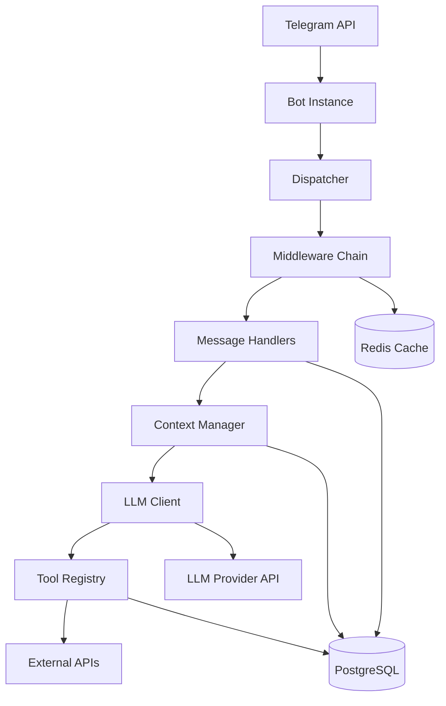
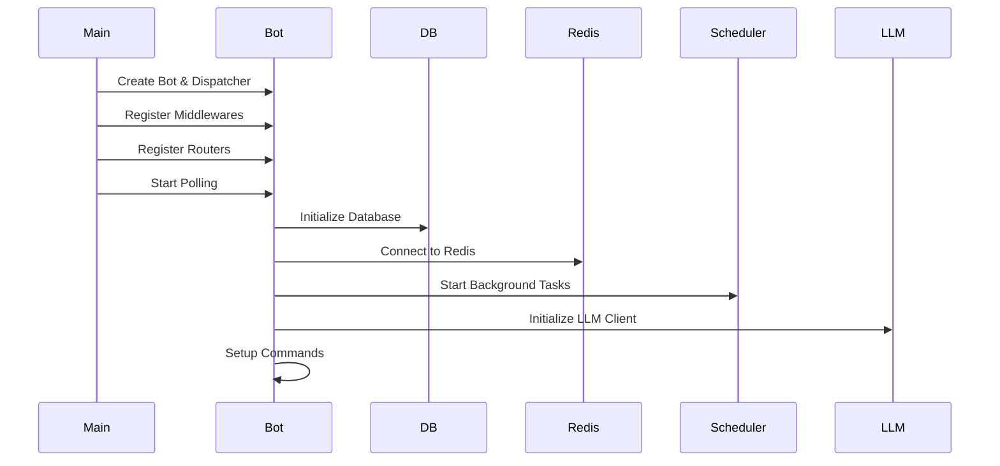
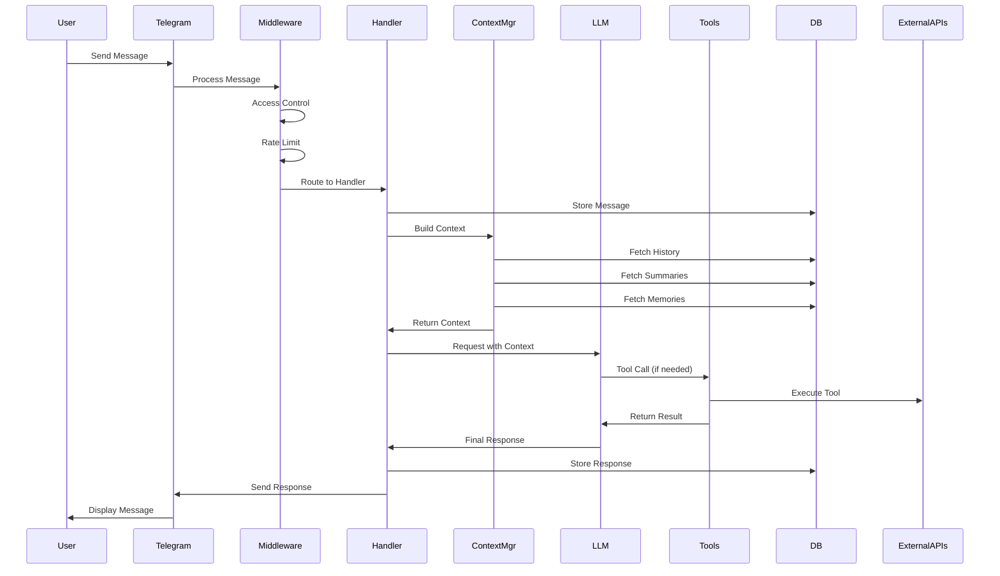
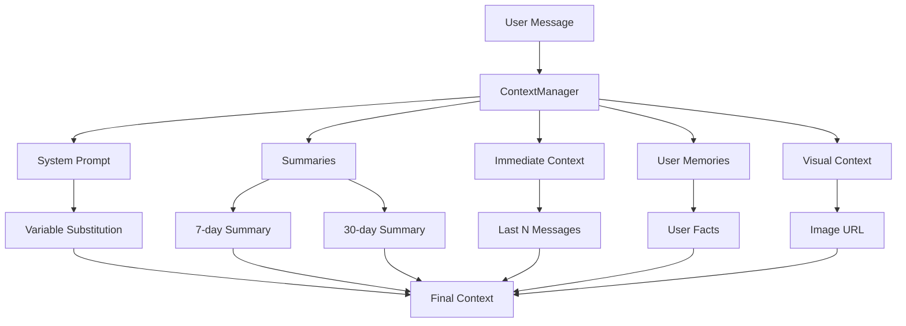
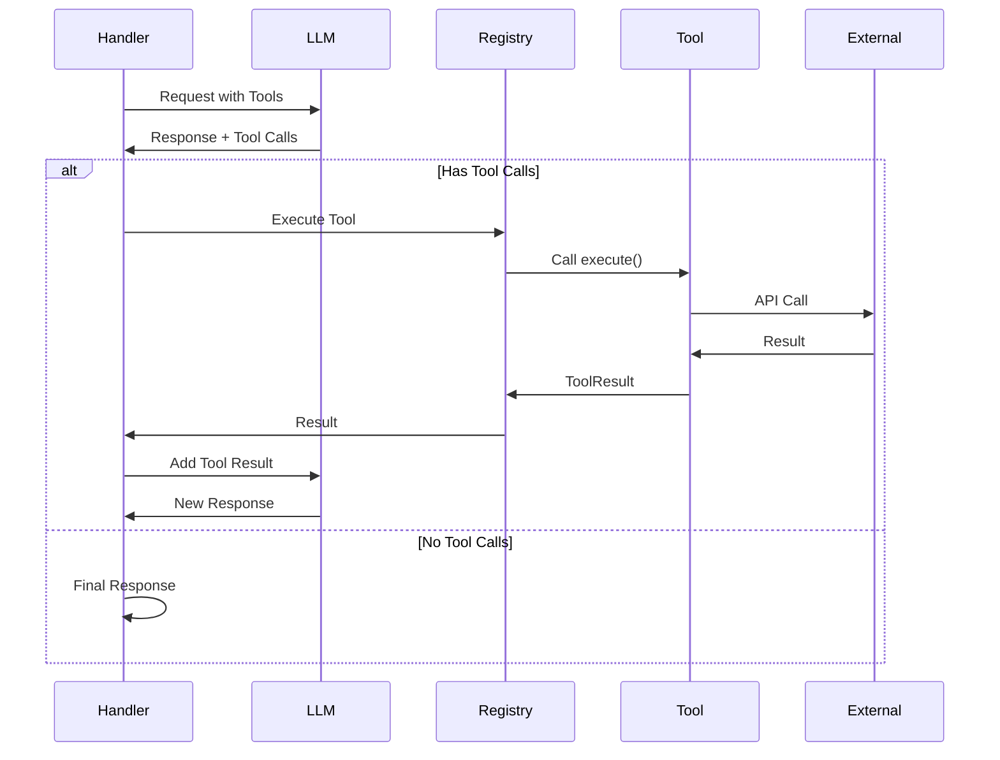
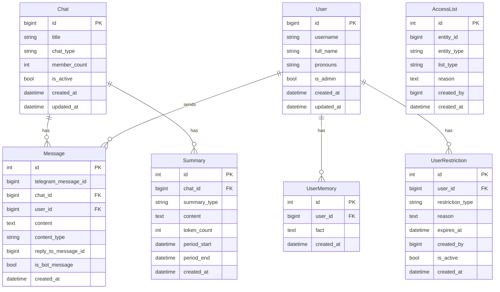
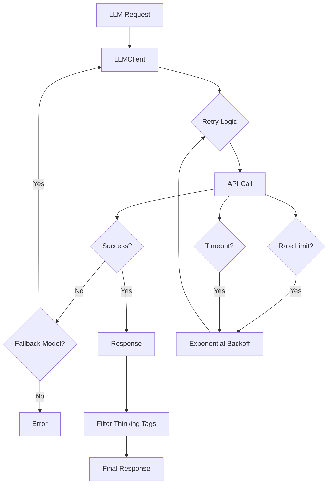

# Architecture

This document provides a comprehensive overview of the Gryag 2.0 bot architecture, including system components, data flows, and design patterns.

## System Overview

Gryag 2.0 is a sophisticated Telegram bot built with Python and aiogram 3.x, featuring:

- **Advanced Context Management**: Multi-layered context system with immediate history, summaries, and user memories
- **LLM Integration**: OpenAI-compatible API client with reliability features
- **Tool Calling**: Extensible tool system for calculator, weather, search, image generation, and memory management
- **Access Control**: Multi-layer security with admin controls, rate limiting, and whitelist/blacklist
- **Database Persistence**: PostgreSQL for messages, users, chats, summaries, and memories
- **Caching**: Redis integration for performance optimization

## High-Level Architecture



## Component Architecture

### 1. Bot Initialization (`bot/main.py`)

The bot follows a structured startup sequence:



**Key Responsibilities:**
- Bot authentication and validation
- Database initialization and migrations
- Redis connection setup
- Background scheduler startup
- Command registration

### 2. Middleware Chain

Messages flow through middleware in a specific order:


**Middleware Components:**

1. **LoggingMiddleware** (`bot/middlewares/logging.py`)
   - Logs all incoming messages
   - Tracks user activity
   - Records errors

2. **AccessControlMiddleware** (`bot/middlewares/access_control.py`)
   - Admin bypass check
   - User restriction validation (bans/restrictions)
   - Blacklist verification
   - Access mode enforcement (global/private/whitelist)

3. **RateLimitMiddleware** (`bot/middlewares/rate_limit.py`)
   - Rate limiting for non-admins
   - Configurable limits (requests per time window)
   - Admin bypass

### 3. Message Processing Flow



### 4. Context Management System

The context management system assembles a comprehensive context for the LLM:



**Context Layers:**

1. **System Prompt** (`bot/context/permanent.py`)
   - Base instructions for the bot
   - Variable substitution (username, chat name, etc.)
   - Tool descriptions
   - Behavior guidelines

2. **Summaries** (`bot/context/summarizer.py`)
   - 7-day summary: Recent context (default: 1024 tokens)
   - 30-day summary: Long-term context (default: 4096 tokens)
   - Generated periodically by background scheduler

3. **Immediate Context** (`bot/context/immediate.py`)
   - Last N messages (default: 100)
   - Formatted with user names and reply chains
   - Includes bot responses

4. **User Memories** (`bot/db/repositories/memories.py`)
   - Persistent facts about users (max 50 per user)
   - Stored globally across all chats
   - Managed via memory tools

5. **Visual Context** (`bot/context/manager.py`)
   - Image URLs when replying to photos
   - Vision model processing

### 5. Tool Calling System

The bot uses an iterative tool calling loop:



**Tool Registry** (`bot/tools/registry.py`):
- Centralized tool management
- Auto-discovery and registration
- OpenAI schema generation
- Error handling

**Available Tools:**
1. **Calculator** (`bot/tools/calculator.py`): Safe math evaluation
2. **Weather** (`bot/tools/weather.py`): Weather information via Open-Meteo
3. **Search** (`bot/tools/search.py`): Web search via DuckDuckGo
4. **Image Generation** (`bot/tools/image.py`): DALL-E 3 image generation
5. **Remember Memory** (`bot/tools/memory.py`): Store user facts
6. **Recall Memories** (`bot/tools/memory.py`): Retrieve user facts

### 6. Database Schema



**Repository Pattern:**
- All database access through repository classes
- Located in `bot/db/repositories/`
- Async SQLAlchemy 2.0 ORM
- Session management via context managers

### 7. LLM Client Architecture



**Features:**
- Configurable base URL (OpenAI-compatible APIs)
- Automatic retry with exponential backoff
- Fallback model support
- Request timeout handling
- Token limit management
- Vision model support
- Reasoning mode support (o1/o3 models)

### 8. Handler Architecture

**Router Structure:**
- `commands_router`: Bot commands (`/start`, `/help`, etc.)
- `admin_router`: Admin-only commands (private chats)
- `private_router`: Private chat message handling
- `group_router`: Group chat message handling with triggers

**Message Flow in Handlers:**

1. **Extract Information**: User info, chat info, bot info
2. **Store Message**: Save to database
3. **Build Context**: Assemble full context
4. **LLM Processing**: 
   - Vision handling (if images)
   - Tool calling loop (up to 5 turns)
5. **Store Response**: Save bot message
6. **Send Response**: Reply to user

### 9. Background Scheduler

The scheduler (`bot/context/scheduler.py`) runs periodic tasks:

- **Summary Generation**: Creates 7-day and 30-day summaries
- **Cleanup Tasks**: Removes expired restrictions
- **Health Checks**: Monitors system health

## Design Patterns

### 1. Repository Pattern
All database operations go through repository classes:
- `ChatRepository`: Chat management
- `UserRepository`: User management
- `MessageRepository`: Message storage and retrieval
- `SummaryRepository`: Summary management
- `MemoryRepository`: User memory management

### 2. Middleware Pattern
Request processing pipeline with multiple middleware layers for cross-cutting concerns.

### 3. Tool Registry Pattern
Centralized tool management with auto-discovery and schema generation.

### 4. Context Builder Pattern
Structured context assembly with multiple data sources.

### 5. Strategy Pattern
Different handlers for different chat types (private vs. group).

## Data Flow Examples

### Example 1: Simple Text Message

```
User → Telegram → LoggingMiddleware → AccessControlMiddleware → 
RateLimitMiddleware → PrivateRouter → Store Message → 
Build Context → LLM → Response → Store Response → Send
```

### Example 2: Message with Tool Call

```
User → Handler → Context → LLM → Tool Call Request →
Tool Registry → Calculator Tool → Result → 
LLM (with result) → Final Response → User
```

### Example 3: Group Message with Trigger

```
User → GroupRouter → Trigger Check → 
(if triggered) → Same flow as private message
```

## Performance Considerations

1. **Database Indexing**: Key fields indexed for fast queries
2. **Context Limits**: Configurable token and message limits
3. **Redis Caching**: Optional Redis integration for caching
4. **Connection Pooling**: SQLAlchemy connection pooling
5. **Async Operations**: All I/O operations are async

## Security Architecture

1. **Access Control Layers**:
   - Admin bypass
   - User restrictions (bans/restrictions)
   - Blacklist
   - Access mode (global/private/whitelist)

2. **Rate Limiting**: Prevents abuse
3. **Input Validation**: Tool parameter validation
4. **Safe Execution**: Calculator uses AST parsing (no eval)

## Extension Points

1. **New Tools**: Implement `BaseTool` and register
2. **New Handlers**: Create router and register in dispatcher
3. **New Middleware**: Implement `BaseMiddleware`
4. **Custom Prompts**: Add files to `prompts/` directory
5. **Database Models**: Add to `bot/db/models.py` and create migration

## Related Documentation

- [Context Management](context-management.md) - Deep dive into context system
- [Database Schema](database.md) - Complete database documentation
- [Tool Development](tools.md) - Guide to creating new tools
- [API Reference](api-reference.md) - Code-level documentation
