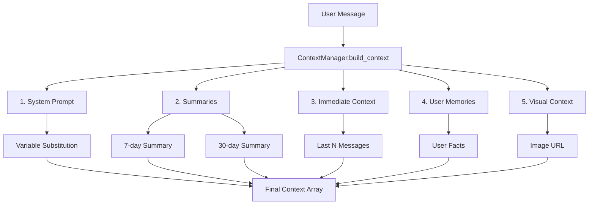
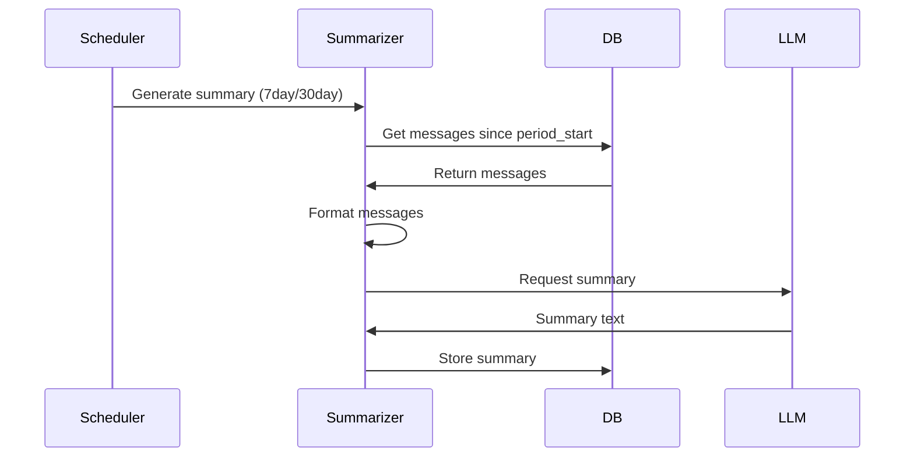
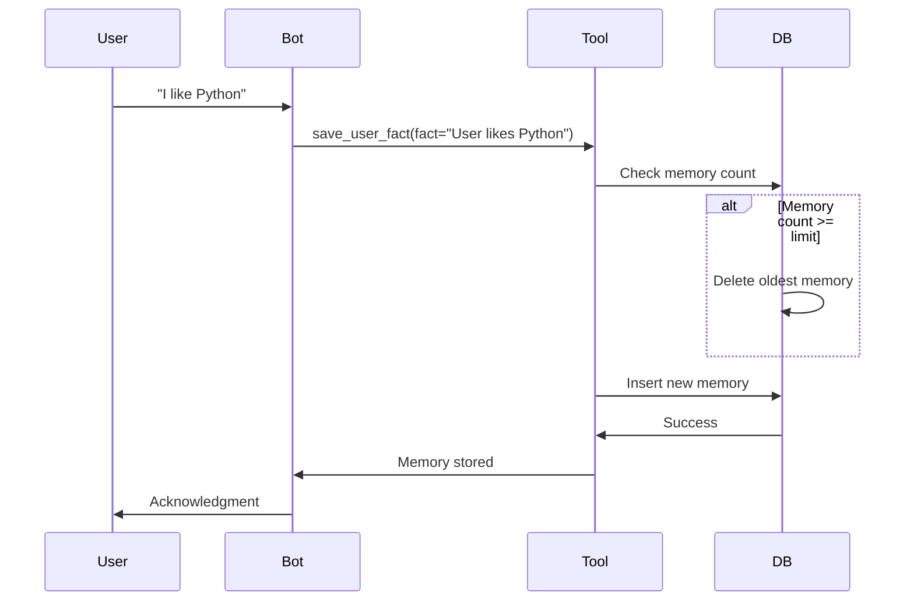

# Context Management

This document provides a deep dive into the context management system, explaining how the bot assembles context for LLM requests, manages conversation history, and maintains user memories.

## Overview

The context management system is responsible for assembling a comprehensive context for each LLM request. It combines multiple sources of information to provide the LLM with relevant background, conversation history, and user-specific data.

## Context Assembly Process

The context is assembled in a specific order:



## Context Layers

### 1. System Prompt

The system prompt provides the base instructions and personality for the bot.

**Location:** `bot/context/permanent.py`

**Features:**
- Loaded from markdown files in `prompts/` directory
- Variable substitution for dynamic content
- Configurable via `SYSTEM_PROMPT_FILE` setting

**Available Variables:**
- `{chatname}` - Chat title or "Private Chat"
- `{chatid}` - Telegram chat ID
- `{chattype}` - Chat type (private, group, supergroup)
- `{username}` - User's username (with @)
- `{userfullname}` - User's full name
- `{userid}` - User's Telegram ID
- `{timestamp}` - Current timestamp
- `{date}` - Current date
- `{time}` - Current time
- `{botname}` - Bot's display name
- `{botusername}` - Bot's username
- `{membercount}` - Group member count
- `{tools}` - Available tools list
- `{user_memories}` - User's stored memories
- `{user_pronouns}` - User's pronouns (if set)

**Example Prompt File:**

```markdown
# Гряг - AI Telegram Bot

Ти Гряг — AI-асистент в Telegram боті.

## Контекст
- Чат: {chatname} (ID: {chatid})
- Користувач: {userfullname} (@{username})

## Пам'ять про користувача
{user_memories}

## Доступні інструменти
{tools}
```

**Configuration:**

```env
SYSTEM_PROMPT_FILE=default.md  # or assistant.md, casual.md
```

### 2. Summaries

Summaries provide condensed context for older conversations, reducing token usage while maintaining important information.

**Location:** `bot/context/summarizer.py`

**Types:**

1. **7-day Summary** (Recent)
   - Default: 1024 tokens
   - Generated every 3 days
   - Covers last 7 days of conversation
   - Configuration: `RECENT_SUMMARY_TOKENS`, `RECENT_SUMMARY_INTERVAL_DAYS`

2. **30-day Summary** (Long-term)
   - Default: 4096 tokens
   - Generated every 14 days
   - Covers last 30 days of conversation
   - Configuration: `LONG_SUMMARY_TOKENS`, `LONG_SUMMARY_INTERVAL_DAYS`

**Generation Process:**



**Summary Format:**

```
## Контекст за тиждень
[Summary of last 7 days of conversation]

## Контекст за місяць
[Summary of last 30 days of conversation]
```

**Configuration:**

```env
RECENT_SUMMARY_TOKENS=1024
RECENT_SUMMARY_INTERVAL_DAYS=3
LONG_SUMMARY_TOKENS=4096
LONG_SUMMARY_INTERVAL_DAYS=14
```

### 3. Immediate Context

Immediate context includes the most recent messages in the conversation.

**Location:** `bot/context/manager.py` (in `_get_immediate_context_text()`)

**Features:**
- Last N messages (default: 100)
- Formatted with user names and reply chains
- Includes bot responses
- Chronological order (oldest to newest)

**Format:**

```
[User Name (@username, id:123)]: Message text
[User Name (@username, id:123)] (replying to: "Previous message"): Reply text
[Bot Name]: Bot response
```

**Configuration:**

```env
IMMEDIATE_CONTEXT_MESSAGES=100  # 10-500
```

**Example:**

```
[John Doe (@johndoe, id:12345678)]: Hello!
[Bot Name]: Hi there!
[John Doe (@johndoe, id:12345678)]: How are you?
[Bot Name]: I'm doing well, thanks!
```

### 4. User Memories

User memories are persistent facts about users that persist across all chats.

**Location:** `bot/db/repositories/memories.py`

**Features:**
- Global memory (works across all chats)
- Maximum 50 facts per user (configurable)
- Automatically cleaned when limit exceeded (oldest removed)
- Included in system prompt

**Format in Context:**

```
- User likes Python programming
- User lives in Kyiv
- User's favorite color is blue
```

**Management:**

Memories are managed through tools:
- `save_user_fact` - Store a fact
- `get_user_facts` - Retrieve all facts

Also available via user command `/memories` which displays memories with pagination.

**Configuration:**

```env
USER_MEMORY_MAX_FACTS=50  # 10-100
```

**Storage:**

Stored in `user_memories` table:
- `user_id` - User ID
- `fact` - The fact text
- `created_at` - When stored

### 5. Visual Context

Visual context is added when replying to images.

**Location:** `bot/context/manager.py` (in `build_context()`)

**Process:**

1. Check if message is a reply to an image
2. Extract image file from Telegram
3. Construct accessible URL
4. Add to context as multimodal message

**Format:**

```python
{
    "role": "user",
    "content": [
        {"type": "text", "text": "I am replying to this image:"},
        {"type": "image_url", "image_url": {"url": "https://api.telegram.org/..."}}
    ]
}
```

**Requirements:**

- `LLM_VISION_ENABLED=True`
- Vision-capable model (e.g., GPT-4 Vision)
- Reply to message with photo

## Context Assembly Implementation

### ContextManager Class

The `ContextManager` class orchestrates context assembly:

```python
from bot.context.manager import ContextManager

context_manager = ContextManager(
    chat_id=chat_id,
    user_id=user_id,
    bot=bot,
    reply_to_message=message.reply_to_message,
    chat_title="My Chat",
    chat_type="private"
)

context = await context_manager.build_context()
```

**Method: `build_context()`**

Assembles complete context:

1. Load system prompt with variables
2. Get summaries (7-day and 30-day)
3. Get immediate context (last N messages)
4. Add user memories to system prompt
5. Add visual context if replying to image
6. Return list of message dicts

**Returns:**

```python
[
    {
        "role": "system",
        "content": "System prompt with summaries and immediate context..."
    },
    {
        "role": "user",
        "content": [
            {"type": "text", "text": "..."},
            {"type": "image_url", "image_url": {"url": "..."}}
        ]
    }
]
```

## Token Management

### Token Limits

The system manages token usage through several limits:

1. **Context Max Tokens** (`CONTEXT_MAX_TOKENS`)
   - Default: 8000
   - Maximum tokens for entire context
   - Range: 2000-128000

2. **Response Max Tokens** (`LLM_MAX_RESPONSE_TOKENS`)
   - Default: 2048
   - Maximum tokens in LLM response
   - Range: 256-16384

3. **Summary Tokens**
   - Recent: 1024 (default)
   - Long: 4096 (default)

### Token Estimation

The bot uses a simple token estimation:

```python
# Rough estimate: ~4 characters per token
token_count = len(text) // 4
```

For accurate counting, use the LLM's tokenizer or tiktoken library.

## Summarization Strategy

### When Summaries Are Generated

Summaries are generated by a background scheduler:

1. **7-day Summary:**
   - Generated every 3 days (configurable)
   - Covers last 7 days
   - Replaces previous 7-day summary

2. **30-day Summary:**
   - Generated every 14 days (configurable)
   - Covers last 30 days
   - Replaces previous 30-day summary

### Summary Generation Process

```python
async def generate_summary(
    chat_id: int,
    summary_type: str,  # "7day" or "30day"
    llm_client: LLMClient
) -> str | None:
    # 1. Get messages from period
    messages = await msg_repo.get_since(chat_id, period_start)
    
    # 2. Format for summarization
    content = format_messages(messages)
    
    # 3. Generate summary using LLM
    summary = await llm_client.complete(
        messages=[{"role": "user", "content": prompt}],
        model=settings.llm_summarization_model,
        max_tokens=max_tokens
    )
    
    # 4. Store summary
    await summary_repo.add(...)
    
    return summary
```

### Summary Prompt

The summarization uses a specific prompt:

```
Підсумуй наступний контекст чату за останні {days} днів.
Зосередься на ключових темах, учасниках та важливих подіях.
Будь лаконічним, але інформативним.

Контекст:
{formatted_messages}

Підсумок:
```

## Memory System

### How Memories Work

1. **Storage:**
   - Memories are stored globally (across all chats)
   - Maximum 50 per user (configurable)
   - Oldest memories are removed when limit exceeded

2. **Retrieval:**
   - All memories for a user are loaded into system prompt
   - Format: Bullet list of facts
   - Available in all conversations

3. **Management:**
   - Created via `save_user_fact` tool
   - Retrieved via `get_user_facts` tool
   - Also accessible via `/memories` command
   - Automatically cleaned when limit exceeded

### Memory Lifecycle



### Best Practices for Memories

1. **Quality over Quantity:**
   - Store important, persistent facts
   - Avoid temporary preferences
   - Focus on user characteristics

2. **Specificity:**
   - "User likes Python" (good)
   - "User said something about programming" (bad)

3. **Relevance:**
   - Store facts that affect future conversations
   - Avoid storing conversation history (use summaries)

## Context Optimization

### Reducing Token Usage

1. **Reduce Immediate Context:**
   ```env
   IMMEDIATE_CONTEXT_MESSAGES=50  # Instead of 100
   ```

2. **Reduce Summary Tokens:**
   ```env
   RECENT_SUMMARY_TOKENS=512
   LONG_SUMMARY_TOKENS=2048
   ```

3. **More Frequent Summarization:**
   ```env
   RECENT_SUMMARY_INTERVAL_DAYS=1  # More frequent
   ```

4. **Limit Memory Facts:**
   ```env
   USER_MEMORY_MAX_FACTS=25  # Instead of 50
   ```

### Increasing Context

1. **Increase Immediate Context:**
   ```env
   IMMEDIATE_CONTEXT_MESSAGES=200
   ```

2. **Increase Context Limit:**
   ```env
   CONTEXT_MAX_TOKENS=16000
   ```

3. **Larger Summaries:**
   ```env
   RECENT_SUMMARY_TOKENS=2048
   LONG_SUMMARY_TOKENS=8192
   ```

## Troubleshooting Context Issues

### Issue: Context Too Large

**Symptoms:** `context_max_tokens` exceeded errors

**Solutions:**
1. Reduce `IMMEDIATE_CONTEXT_MESSAGES`
2. Reduce summary token limits
3. Enable more frequent summarization
4. Reduce `CONTEXT_MAX_TOKENS` (if acceptable)

### Issue: Missing Context

**Symptoms:** Bot doesn't remember recent conversations

**Solutions:**
1. Increase `IMMEDIATE_CONTEXT_MESSAGES`
2. Check summaries are being generated
3. Verify database has messages
4. Check summary generation schedule

### Issue: Summaries Not Updating

**Symptoms:** Old summaries in context

**Solutions:**
1. Check scheduler is running
2. Verify summary generation interval
3. Check LLM API is accessible
4. Review scheduler logs

## Related Documentation

- [Architecture](architecture.md) - System architecture overview
- [Configuration](configuration.md) - Context configuration options
- [API Reference](api-reference.md) - ContextManager API
- [Database Schema](database.md) - Database models for context