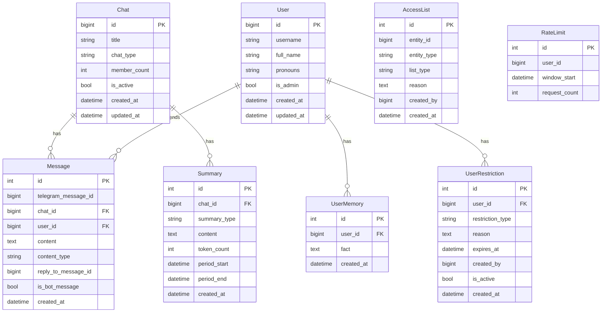

# Database Schema

This document provides complete documentation of the database schema, including entity relationships, table structures, and usage patterns.

## Overview

The bot uses PostgreSQL as its primary database, managed through SQLAlchemy 2.0 ORM and Alembic migrations. All database operations are async using `asyncpg` driver.

## Entity Relationship Diagram



## Tables

### Chat

Stores Telegram chat metadata and settings.

**Table:** `chats`

**Columns:**

| Column | Type | Description | Constraints |
|--------|------|-------------|-------------|
| `id` | `BIGINT` | Telegram chat ID | PRIMARY KEY |
| `title` | `VARCHAR(255)` | Chat title | NULLABLE |
| `chat_type` | `VARCHAR(20)` | Chat type (private, group, supergroup, channel) | NOT NULL |
| `member_count` | `INT` | Number of members | NULLABLE |
| `is_active` | `BOOLEAN` | Whether chat is active | DEFAULT TRUE |
| `created_at` | `TIMESTAMP` | Creation timestamp | DEFAULT NOW() |
| `updated_at` | `TIMESTAMP` | Last update timestamp | DEFAULT NOW(), ON UPDATE |

**Relationships:**
- One-to-many with `Message`
- One-to-many with `Summary`

**Indexes:**
- Primary key on `id`

**Usage:**

```python
from bot.db.repositories import ChatRepository

async with get_session() as session:
    repo = ChatRepository(session)
    chat = await repo.get_or_create(
        chat_id=-1001234567890,
        title="My Group",
        chat_type="supergroup",
        member_count=50
    )
```

### User

Stores Telegram user information and settings.

**Table:** `users`

**Columns:**

| Column | Type | Description | Constraints |
|--------|------|-------------|-------------|
| `id` | `BIGINT` | Telegram user ID | PRIMARY KEY |
| `username` | `VARCHAR(255)` | Telegram username | NULLABLE |
| `full_name` | `VARCHAR(255)` | User's full name | NOT NULL |
| `pronouns` | `VARCHAR(50)` | User's pronouns | NULLABLE |
| `is_admin` | `BOOLEAN` | Whether user is admin | DEFAULT FALSE |
| `created_at` | `TIMESTAMP` | Creation timestamp | DEFAULT NOW() |
| `updated_at` | `TIMESTAMP` | Last update timestamp | DEFAULT NOW(), ON UPDATE |

**Relationships:**
- One-to-many with `Message`
- One-to-many with `UserMemory`
- One-to-many with `UserRestriction`

**Indexes:**
- Primary key on `id`

**Usage:**

```python
from bot.db.repositories import UserRepository

async with get_session() as session:
    repo = UserRepository(session)
    user = await repo.get_or_create(
        user_id=12345678,
        username="johndoe",
        full_name="John Doe"
    )
```

### Message

Stores all messages for context management.

**Table:** `messages`

**Columns:**

| Column | Type | Description | Constraints |
|--------|------|-------------|-------------|
| `id` | `INT` | Internal message ID | PRIMARY KEY, AUTO_INCREMENT |
| `telegram_message_id` | `BIGINT` | Telegram message ID | NOT NULL |
| `chat_id` | `BIGINT` | Chat ID | FOREIGN KEY, NOT NULL |
| `user_id` | `BIGINT` | User ID | FOREIGN KEY, NULLABLE |
| `content` | `TEXT` | Message content | NOT NULL |
| `content_type` | `VARCHAR(50)` | Content type (text, photo, etc.) | DEFAULT 'text' |
| `reply_to_message_id` | `BIGINT` | Telegram ID of replied message | NULLABLE |
| `is_bot_message` | `BOOLEAN` | Whether message is from bot | DEFAULT FALSE |
| `created_at` | `TIMESTAMP` | Creation timestamp | DEFAULT NOW() |

**Relationships:**
- Many-to-one with `Chat`
- Many-to-one with `User`

**Indexes:**
- Primary key on `id`
- Index on `(chat_id, created_at)` for recent message queries
- Index on `(chat_id, telegram_message_id)` for lookups

**Usage:**

```python
from bot.db.repositories import MessageRepository

async with get_session() as session:
    repo = MessageRepository(session)
    
    # Add message
    message = await repo.add(
        telegram_message_id=12345,
        chat_id=-1001234567890,
        user_id=12345678,
        content="Hello!",
        content_type="text"
    )
    
    # Get recent messages
    messages = await repo.get_recent(chat_id=-1001234567890, limit=100)
```

### Summary

Stores generated context summaries.

**Table:** `summaries`

**Columns:**

| Column | Type | Description | Constraints |
|--------|------|-------------|-------------|
| `id` | `INT` | Summary ID | PRIMARY KEY, AUTO_INCREMENT |
| `chat_id` | `BIGINT` | Chat ID | FOREIGN KEY, NOT NULL |
| `summary_type` | `VARCHAR(20)` | Summary type (7day, 30day) | NOT NULL |
| `content` | `TEXT` | Summary content | NOT NULL |
| `token_count` | `INT` | Estimated token count | NOT NULL |
| `period_start` | `TIMESTAMP` | Period start | NOT NULL |
| `period_end` | `TIMESTAMP` | Period end | NOT NULL |
| `created_at` | `TIMESTAMP` | Creation timestamp | DEFAULT NOW() |

**Relationships:**
- Many-to-one with `Chat`

**Indexes:**
- Primary key on `id`
- Index on `(chat_id, summary_type)` for latest summary queries

**Usage:**

```python
from bot.db.repositories import SummaryRepository

async with get_session() as session:
    repo = SummaryRepository(session)
    
    # Get latest 7-day summary
    summary = await repo.get_latest(chat_id=-1001234567890, summary_type="7day")
```

### UserMemory

Stores persistent facts about users.

**Table:** `user_memories`

**Columns:**

| Column | Type | Description | Constraints |
|--------|------|-------------|-------------|
| `id` | `INT` | Memory ID | PRIMARY KEY, AUTO_INCREMENT |
| `user_id` | `BIGINT` | User ID | FOREIGN KEY, NOT NULL |
| `fact` | `TEXT` | The fact to remember | NOT NULL |
| `created_at` | `TIMESTAMP` | Creation timestamp | DEFAULT NOW() |

**Relationships:**
- Many-to-one with `User`

**Indexes:**
- Primary key on `id`
- Index on `user_id` for user memory queries

**Usage:**

```python
from bot.db.repositories import MemoryRepository

async with get_session() as session:
    repo = MemoryRepository(session, max_facts=50)
    
    # Add memory
    await repo.add_memory(user_id=12345678, fact="User likes Python")
    
    # Get all memories
    memories = await repo.get_memories(user_id=12345678)
```

### UserRestriction

Stores bot-level bans and restrictions.

**Table:** `user_restrictions`

**Columns:**

| Column | Type | Description | Constraints |
|--------|------|-------------|-------------|
| `id` | `INT` | Restriction ID | PRIMARY KEY, AUTO_INCREMENT |
| `user_id` | `BIGINT` | User ID | FOREIGN KEY, NOT NULL |
| `restriction_type` | `VARCHAR(20)` | Type (ban, restrict) | NOT NULL |
| `reason` | `TEXT` | Reason for restriction | NULLABLE |
| `expires_at` | `TIMESTAMP` | Expiration time | NULLABLE (NULL = permanent) |
| `created_by` | `BIGINT` | Admin who created | NOT NULL |
| `is_active` | `BOOLEAN` | Whether restriction is active | DEFAULT TRUE |
| `created_at` | `TIMESTAMP` | Creation timestamp | DEFAULT NOW() |

**Relationships:**
- Many-to-one with `User`

**Indexes:**
- Primary key on `id`
- Index on `(user_id, is_active)` for active restriction queries

**Usage:**

```python
from bot.db.models import UserRestriction

async with get_session() as session:
    restriction = UserRestriction(
        user_id=12345678,
        restriction_type="ban",
        reason="Spam",
        expires_at=None,  # Permanent
        created_by=admin_id,
        is_active=True
    )
    session.add(restriction)
    await session.commit()
```

### AccessList

Stores whitelist and blacklist entries.

**Table:** `access_list`

**Columns:**

| Column | Type | Description | Constraints |
|--------|------|-------------|-------------|
| `id` | `INT` | Entry ID | PRIMARY KEY, AUTO_INCREMENT |
| `entity_id` | `BIGINT` | User or chat ID | NOT NULL |
| `entity_type` | `VARCHAR(20)` | Type (user, chat) | NOT NULL |
| `list_type` | `VARCHAR(20)` | List type (whitelist, blacklist) | NOT NULL |
| `reason` | `TEXT` | Reason for listing | NULLABLE |
| `created_by` | `BIGINT` | Admin who added | NULLABLE |
| `created_at` | `TIMESTAMP` | Creation timestamp | DEFAULT NOW() |

**Indexes:**
- Primary key on `id`
- Unique index on `(entity_id, entity_type, list_type)`

**Usage:**

```python
from bot.db.models import AccessList

async with get_session() as session:
    entry = AccessList(
        entity_id=-1001234567890,
        entity_type="chat",
        list_type="whitelist",
        created_by=admin_id
    )
    session.add(entry)
    await session.commit()
```

### RateLimit

Tracks rate limiting for users (optional, can use in-memory).

**Table:** `rate_limits`

**Columns:**

| Column | Type | Description | Constraints |
|--------|------|-------------|-------------|
| `id` | `INT` | Entry ID | PRIMARY KEY, AUTO_INCREMENT |
| `user_id` | `BIGINT` | User ID | NOT NULL |
| `window_start` | `TIMESTAMP` | Window start time | NOT NULL |
| `request_count` | `INT` | Number of requests | DEFAULT 0 |

**Indexes:**
- Primary key on `id`
- Index on `user_id`
- Index on `(user_id, window_start)`

**Note:** Currently, rate limiting uses in-memory storage. This table is available for future Redis-free implementations.

## Repository Pattern

All database access goes through repository classes located in `bot/db/repositories/`.

### Repository Interface

All repositories follow this pattern:

```python
class Repository:
    def __init__(self, session: AsyncSession):
        self.session = session
    
    async def get_by_id(self, id: int) -> Model | None:
        """Get by ID."""
        pass
    
    async def get_or_create(self, **kwargs) -> Model:
        """Get existing or create new."""
        pass
```

### Available Repositories

- `ChatRepository` - Chat operations
- `UserRepository` - User operations
- `MessageRepository` - Message operations
- `SummaryRepository` - Summary operations
- `MemoryRepository` - Memory operations

See [API Reference](api-reference.md) for detailed repository documentation.

## Database Migrations

Migrations are managed using Alembic.

### Creating Migrations

```bash
# Auto-generate from model changes
alembic revision --autogenerate -m "Description"

# Manual migration
alembic revision -m "Description"
```

### Applying Migrations

```bash
# Apply all pending migrations
alembic upgrade head

# Apply specific migration
alembic upgrade <revision>

# Rollback one migration
alembic downgrade -1
```

### Migration Files

Located in `migrations/versions/` with format:
- `YYYYMMDDHHMMSS_description.py`

## Query Optimization

### Indexes

Key indexes for performance:

1. **Messages:**
   - `(chat_id, created_at)` - For recent message queries
   - `(chat_id, telegram_message_id)` - For message lookups

2. **Summaries:**
   - `(chat_id, summary_type)` - For latest summary queries

3. **User Memories:**
   - `user_id` - For user memory queries

4. **Restrictions:**
   - `(user_id, is_active)` - For active restriction checks

### Query Patterns

**Get Recent Messages:**

```python
# Uses index on (chat_id, created_at)
messages = await repo.get_recent(chat_id, limit=100)
```

**Get Messages Since:**

```python
# Uses index on (chat_id, created_at)
messages = await repo.get_since(chat_id, since=datetime)
```

**Get Latest Summary:**

```python
# Uses index on (chat_id, summary_type)
summary = await repo.get_latest(chat_id, summary_type="7day")
```

## Connection Management

### Session Factory

Sessions are created via a factory:

```python
from bot.db.session import get_session

async with get_session() as session:
    # Use session
    repo = MessageRepository(session)
    messages = await repo.get_recent(chat_id)
    # Session auto-commits on exit
```

### Connection Pooling

Configured in `bot/db/session.py`:

```python
_engine = create_async_engine(
    database_url,
    pool_size=10,      # Base pool size
    max_overflow=20,   # Max overflow connections
    pool_pre_ping=True # Verify connections
)
```

## Backup and Restore

### Backup

```bash
# Full database backup
pg_dump -U bot gryag > backup.sql

# With compression
pg_dump -U bot gryag | gzip > backup.sql.gz
```

### Restore

```bash
# Restore from backup
psql -U bot gryag < backup.sql

# From compressed backup
gunzip < backup.sql.gz | psql -U bot gryag
```

## Related Documentation

- [API Reference](api-reference.md) - Repository API documentation
- [Architecture](architecture.md) - System architecture
- [Deployment](deployment.md) - Deployment and migration guide