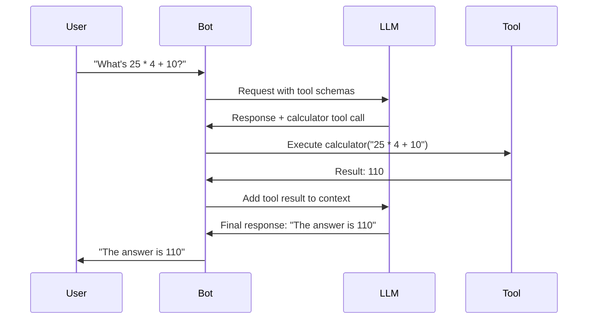

# Tools

Gryag bot supports extending functionality through tool calling, which the AI can invoke as needed. Tools allow the bot to perform actions beyond text generation, such as calculations, web searches, and data retrieval.

## How Tool Calling Works

The bot uses an iterative tool calling loop:



**Process:**
1. User sends a message
2. Bot builds context and sends to LLM with available tool schemas
3. LLM analyzes the request and decides if a tool is needed
4. If needed, LLM generates a tool call request
5. Bot executes the tool and returns result to LLM
6. LLM formulates final response based on tool result
7. Bot sends response to user

**Iterative Loop:** The bot can make up to 5 tool calls in sequence if needed (e.g., search web → calculate → format response).

## Available Tools

### 1. Calculator (`calculator`)

Safely evaluates mathematical expressions using AST parsing (no `eval()`).

**Features:**
- Basic arithmetic: `+`, `-`, `*`, `/`
- Power operations: `**`
- Floor division: `//`
- Modulo: `%`
- Parentheses: `( )`
- Unary operators: `+`, `-`

**Parameters:**
- `expression` (string, required): Mathematical expression

**Examples:**
- "Calculate (25 * 4) / 5"
- "What's 2^10?"
- "Compute 100 + 50 - 30"

**Safety:**
- Uses Python AST (Abstract Syntax Tree) parsing
- Only allows safe mathematical operations
- No code execution or function calls
- No access to system functions

**Implementation:** `bot/tools/calculator.py`

### 2. Weather (`weather`)

Provides current weather information for any location worldwide using the Open-Meteo API (free, no API key required).

**Features:**
- Current temperature
- "Feels like" temperature
- Weather conditions (sunny, cloudy, rain, etc.)
- Humidity percentage
- Wind speed
- Precipitation amount

**Parameters:**
- `location` (string, required): City name or location (e.g., "Kyiv", "London, UK", "New York")

**Examples:**
- "What's the weather in Kyiv?"
- "Check weather for London"
- "How's the weather in New York City?"

**Data Source:** [Open-Meteo API](https://open-meteo.com/) - Free weather API

**Implementation:** `bot/tools/weather.py`

### 3. Web Search (`search_web`)

Searches the web for current information, news, and facts using DuckDuckGo.

**Features:**
- Real-time web search
- Multiple results (configurable)
- Title, description, and URL for each result
- No API key required

**Parameters:**
- `query` (string, required): Search query
- `max_results` (integer, optional): Maximum number of results (default: 5, max: 10)

**Examples:**
- "Search for latest news about AI"
- "Find information about Python 3.13"
- "What happened in Ukraine today?"

**Data Source:** DuckDuckGo Search API (via `ddgs` library)

**Implementation:** `bot/tools/search.py`

### 4. Image Generation (`generate_image`)

Generates images using DALL-E 3 (or compatible image generation API).

**Features:**
- Text-to-image generation
- High-quality images (1024x1024)
- Detailed prompt support

**Parameters:**
- `prompt` (string, required): Detailed description of the image to generate
- `size` (string, optional): Image size (default: "1024x1024")

**Examples:**
- "Generate an image of a sunset over mountains"
- "Create a picture of a robot reading a book"
- "Make an image of a futuristic city"

**Requirements:**
- `IMAGE_GENERATION_ENABLED=True` in configuration
- Valid API key with image generation access
- Uses same API endpoint as LLM (or separate if configured)

**Implementation:** `bot/tools/image.py`

### 5. Save User Fact (`save_user_fact`)

Stores a persistent fact about the user that will be remembered across all chats.

**Features:**
- Global memory (works across all chats)
- Maximum 50 facts per user (configurable)
- Automatic cleanup of oldest memories when limit reached
- Used in system prompt for context

**Parameters:**
- `fact` (string, required): The fact to save (e.g., "User likes cats", "User lives in Kyiv")

**Examples:**
- User: "I love programming in Python"
  - Bot calls: `save_user_fact(fact="User loves programming in Python")`
- User: "My favorite color is blue"
  - Bot calls: `save_user_fact(fact="User's favorite color is blue")`

**Storage:** PostgreSQL database (`user_memories` table)

**Implementation:** `bot/tools/memory.py`

**Note:** User ID is automatically injected by handlers when this tool is called.

### 6. Get User Facts (`get_user_facts`)

Retrieves all stored facts about the user.

**Features:**
- Returns all user memories
- Optional search/filtering
- Formatted list output

**Parameters:**
- `query` (string, optional): Optional search query to filter facts

**Examples:**
- Bot calls: `get_user_facts()` - Returns all facts
- Bot calls: `get_user_facts(query="color")` - Returns facts containing "color"

**Use Cases:**
- When user asks "What do you know about me?"
- When bot needs to reference user preferences
- For context in conversations

**Implementation:** `bot/tools/memory.py`

**Note:** User ID is automatically injected by handlers when this tool is called.

## Tool Registry

All tools are registered in the `ToolRegistry` (`bot/tools/registry.py`):

- **Auto-discovery**: Tools are automatically registered on startup
- **Schema Generation**: Converts tools to OpenAI function calling format
- **Error Handling**: Catches and reports tool execution errors
- **Execution**: Async tool execution with result handling

### Tool Registration

Tools are registered in `bot/tools/registry.py`:

```python
def _register_default_tools(registry: ToolRegistry) -> None:
    registry.register(CalculatorTool())
    registry.register(WeatherTool())
    registry.register(SearchTool())
    registry.register(GenerateImageTool())
    registry.register(SaveUserFactTool())
    registry.register(GetUserFactsTool())
```

## Creating Custom Tools

### Tool Interface

All tools must implement the `BaseTool` interface:

```python
from bot.tools.base import BaseTool, ToolResult

class MyCustomTool(BaseTool):
    name = "my_tool"
    description = "Description of what the tool does"
    parameters = {
        "type": "object",
        "properties": {
            "param1": {
                "type": "string",
                "description": "Parameter description"
            }
        },
        "required": ["param1"]
    }
    
    async def execute(self, param1: str, **kwargs) -> ToolResult:
        try:
            # Tool logic here
            result = do_something(param1)
            return ToolResult(
                success=True,
                output=f"Result: {result}",
                data={"result": result}
            )
        except Exception as e:
            return ToolResult(
                success=False,
                output="",
                error=str(e)
            )
```

### ToolResult

Tools return a `ToolResult` object:

- `success` (bool): Whether execution succeeded
- `output` (str): Human-readable output for LLM
- `data` (dict): Structured data (optional)
- `error` (str): Error message if failed

### Registering Your Tool

1. **Create tool file** in `bot/tools/`:
   ```python
   # bot/tools/mytool.py
   from bot.tools.base import BaseTool, ToolResult
   
   class MyTool(BaseTool):
       # ... implementation
   ```

2. **Register in registry** (`bot/tools/registry.py`):
   ```python
   from bot.tools.mytool import MyTool
   
   def _register_default_tools(registry: ToolRegistry) -> None:
       # ... existing tools
       registry.register(MyTool())
   ```

3. **Restart bot** to load new tool

### Best Practices

1. **Error Handling:**
   - Always catch exceptions
   - Return meaningful error messages
   - Log errors for debugging

2. **Input Validation:**
   - Validate parameters in `execute()` method
   - Use type hints for clarity
   - Provide clear error messages

3. **Async Operations:**
   - Use `async/await` for I/O operations
   - Don't block the event loop
   - Use timeouts for external API calls

4. **Documentation:**
   - Clear `description` for LLM understanding
   - Detailed parameter descriptions
   - Include examples in docstrings

5. **Security:**
   - Validate all inputs
   - Sanitize outputs
   - Don't execute arbitrary code
   - Use safe APIs and libraries

### Example: Custom Tool

```python
"""Example custom tool for fetching user information."""

import httpx
from bot.tools.base import BaseTool, ToolResult

class UserInfoTool(BaseTool):
    """Fetch user information from an API."""
    
    name = "get_user_info"
    description = "Get user information by username from external API"
    parameters = {
        "type": "object",
        "properties": {
            "username": {
                "type": "string",
                "description": "Username to look up"
            }
        },
        "required": ["username"]
    }
    
    async def execute(self, username: str, **kwargs) -> ToolResult:
        """Execute user info lookup."""
        try:
            async with httpx.AsyncClient(timeout=10.0) as client:
                response = await client.get(
                    f"https://api.example.com/users/{username}"
                )
                response.raise_for_status()
                data = response.json()
                
                return ToolResult(
                    success=True,
                    output=f"User {username}: {data.get('name', 'Unknown')}",
                    data=data
                )
        except httpx.HTTPError as e:
            return ToolResult(
                success=False,
                output="",
                error=f"API error: {e}"
            )
        except Exception as e:
            return ToolResult(
                success=False,
                output="",
                error=f"Unexpected error: {e}"
            )
```

## Tool Calling Workflow

### Single Tool Call

```
User: "What's 2 + 2?"
→ LLM: Calls calculator("2 + 2")
→ Tool: Returns "2 + 2 = 4"
→ LLM: "The answer is 4"
```

### Multiple Tool Calls

```
User: "What's the weather in Kyiv and calculate 10 * 5?"
→ LLM: Calls weather("Kyiv") and calculator("10 * 5")
→ Tools: Return weather data and calculation result
→ LLM: Combines results into final response
```

### Iterative Tool Calls

```
User: "Search for Python 3.13 features and summarize"
→ LLM: Calls search_web("Python 3.13 features")
→ Tool: Returns search results
→ LLM: Analyzes results and generates summary
→ Bot: Sends summary to user
```

## Multimodality (Vision)

While not a standalone "tool", the bot supports image recognition:

**Features:**
- Image analysis via vision models
- Reply to images with text questions
- Automatic image URL extraction from Telegram

**Usage:**
1. Send a photo to the bot
2. Reply to a photo with a question (e.g., "What's in this image?")
3. Bot analyzes the image and responds

**Configuration:**
- `LLM_VISION_ENABLED=True` (required)
- `LLM_VISION_MODEL` (or falls back to `LLM_MODEL`)
- Vision-capable model required (e.g., GPT-4 Vision, Claude 3)

**Implementation:** Image handling in `bot/context/manager.py` and `bot/handlers/private.py`

## Tool Limitations

1. **Rate Limits**: External APIs may have rate limits
2. **Timeout**: Tools should complete within reasonable time
3. **Error Handling**: Tools must handle failures gracefully
4. **Token Limits**: Tool results count toward context limits
5. **Iteration Limit**: Maximum 5 tool calls per request

## Debugging Tools

### View Available Tools

Use admin command `/config` to see tool configuration.

### Log Tool Executions

Tool executions are logged at INFO level:
```
INFO: Executing tool calculator with args: {'expression': '2+2'}
```

### Test Tools Manually

You can test tools in Python:

```python
from bot.tools.registry import get_registry

registry = get_registry()
result = await registry.execute("calculator", expression="2+2")
print(result.output)
```

## Related Documentation

- [Architecture](architecture.md) - System architecture including tool system
- [API Reference](api-reference.md) - Tool base classes and interfaces
- [Development Guide](development.md) - Guide to adding new features
