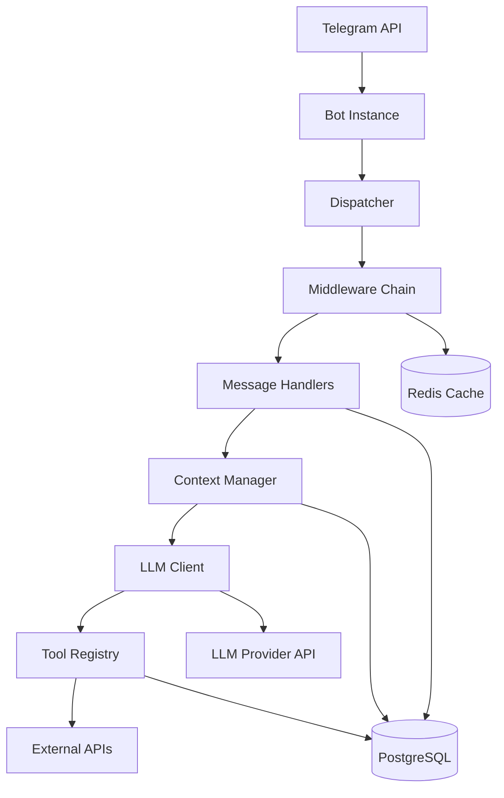
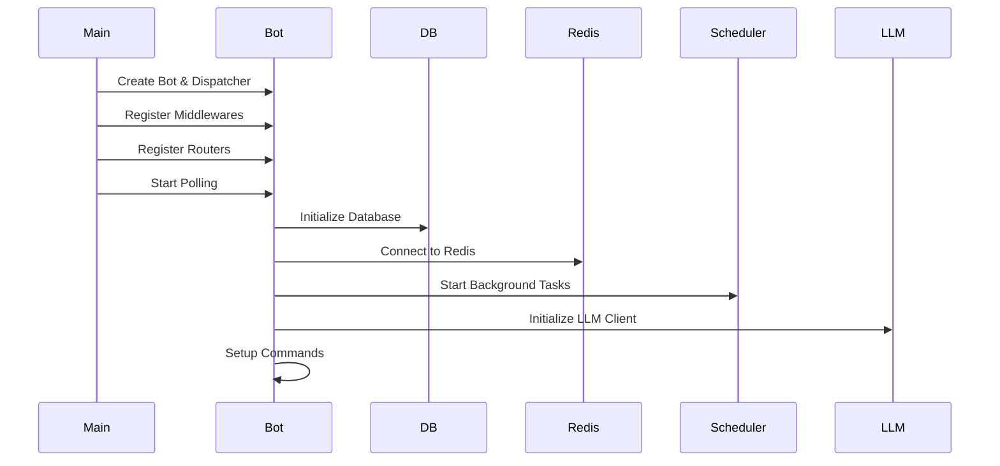
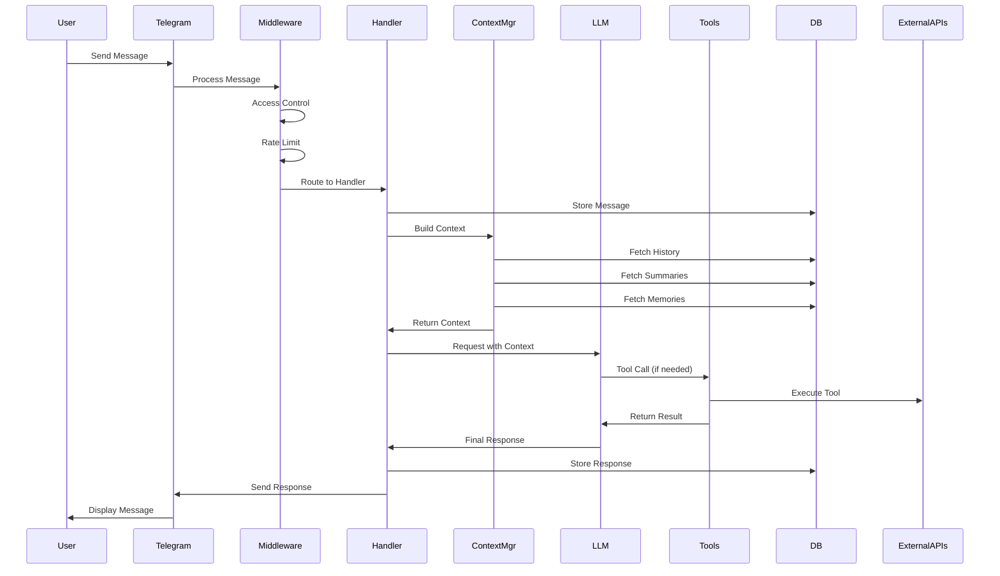
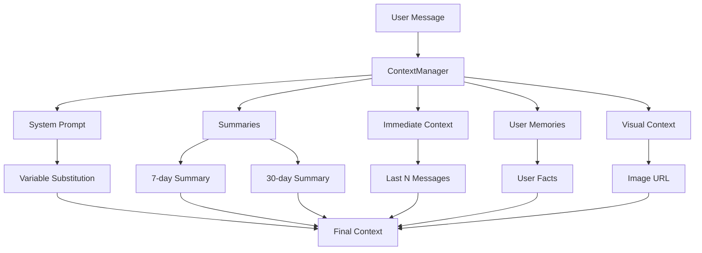
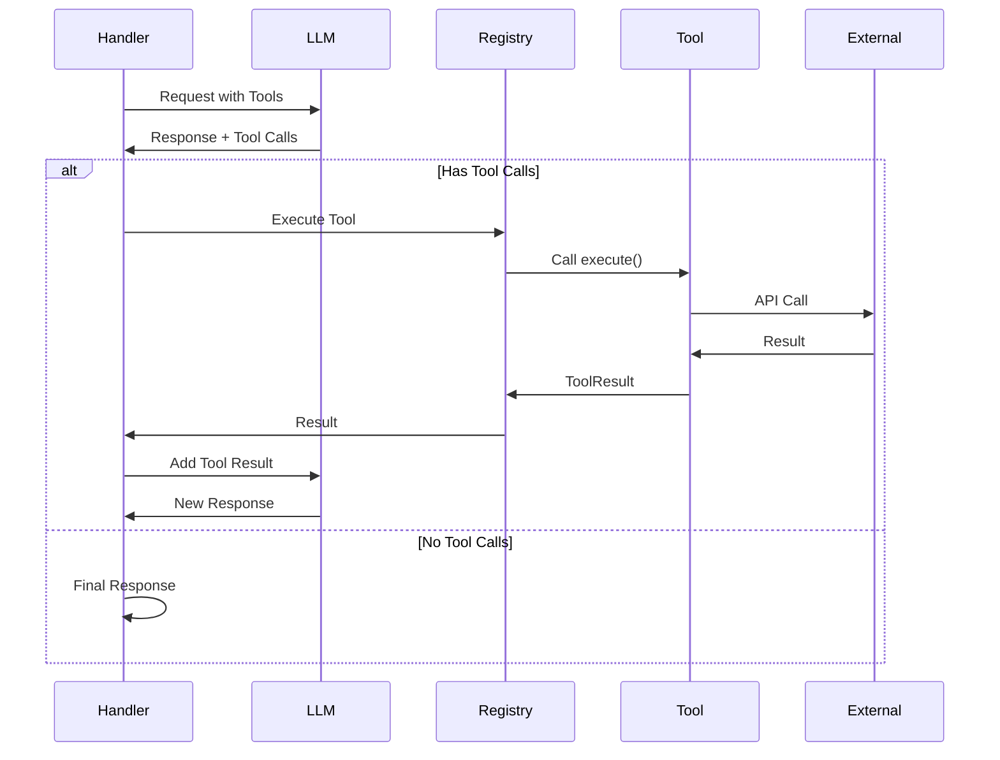
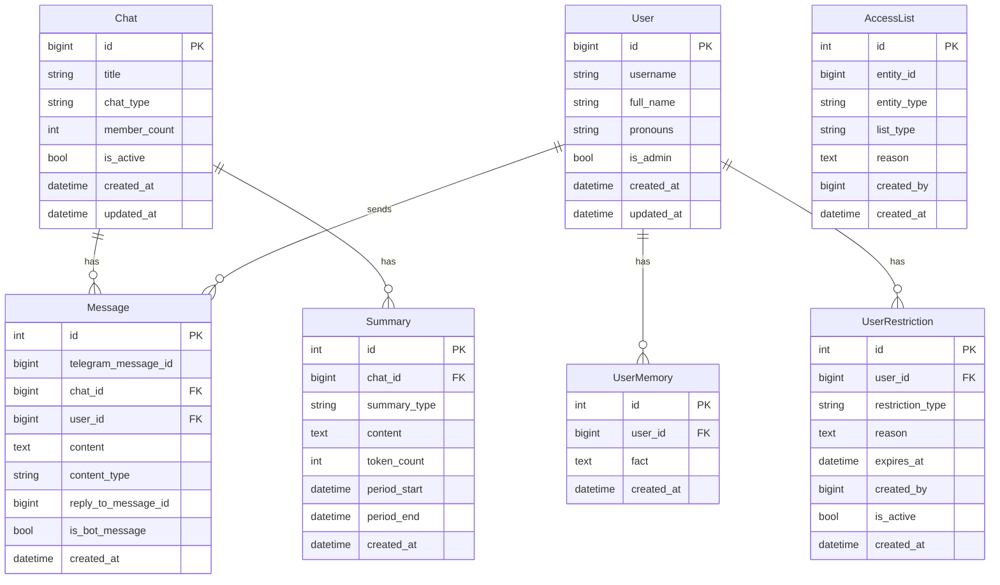
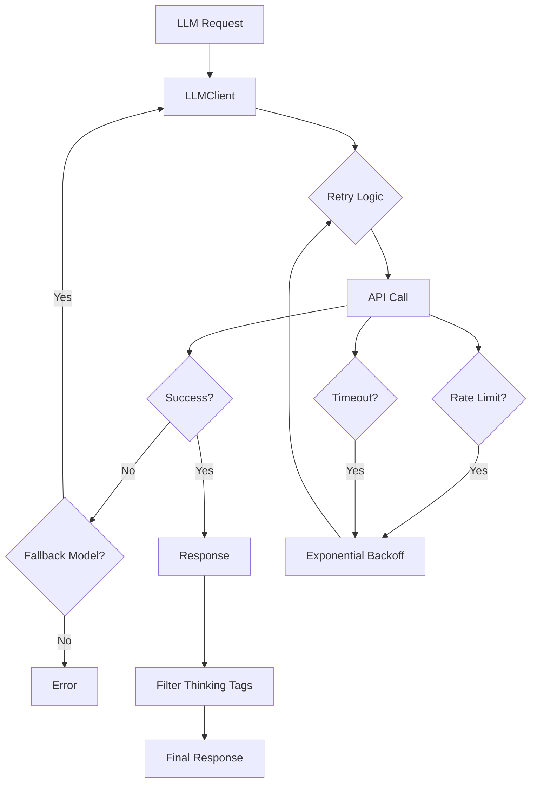

# Архітектура

Цей документ надає комплексний огляд архітектури бота Гряг 2.0, включаючи системні компоненти, потоки даних та патерни проектування.

## Огляд системи

Гряг 2.0 — це складний Telegram бот, побудований на Python та aiogram 3.x, що має такі особливості:

- **Розширене керування контекстом**: Багатошаровий контекст з історією, підсумками та пам'яттю користувачів
- **Інтеграція LLM**: Клієнт сумісний з OpenAI API з функціями надійності
- **Виклик інструментів**: Розширювана система інструментів для калькулятора, погоди, генерації зображень та іншого
- **Контроль доступу**: Багатошаровий захист з адмін-контролем, обмеженням частоти та білими/чорними списками
- **Персистентність даних**: PostgreSQL для повідомлень, користувачів, чатів, підсумків та пам'яті
- **Кешування**: Інтеграція Redis для оптимізації продуктивності

## Високорівнева архітектура



## Архітектура компонентів

### 1. Ініціалізація бота (`bot/main.py`)

Бот слідує структурованій послідовності запуску:



**Ключові обов'язки:**
- Аутентифікація та валідація бота
- Ініціалізація бази даних та міграції
- Налаштування підключення Redis
- Запуск фонового планувальника
- Реєстрація команд

### 2. Ланцюг Middleware

Повідомлення проходять через middleware у певному порядку:


**Компоненти Middleware:**

1. **LoggingMiddleware** (`bot/middlewares/logging.py`)
   - Логує всі вхідні повідомлення
   - Відстежує активність користувачів
   - Записує помилки

2. **AccessControlMiddleware** (`bot/middlewares/access_control.py`)
   - Обхід для адмінів
   - Валідація обмежень користувачів (бани/обмеження)
   - Перевірка чорного списку
   - Застосування режиму доступу (global/private/whitelist)

3. **RateLimitMiddleware** (`bot/middlewares/rate_limit.py`)
   - Обмеження частоти для не-адмінів
   - Налаштовувані ліміти (запитів за період)
   - Обхід для адмінів

### 3. Потік обробки повідомлень



### 4. Система керування контекстом

Система керування контекстом збирає комплексний контекст для LLM:



**Шари контексту:**

1. **System Prompt** (`bot/context/permanent.py`)
   - Базові інструкції для бота
   - Підстановка змінних (ім'я користувача, назва чату тощо)
   - Опис інструментів
   - Керівні принципи поведінки

2. **Summaries** (`bot/context/summarizer.py`)
   - 7-денний підсумок: Недавній контекст (за замовчуванням: 1024 токени)
   - 30-денний підсумок: Довгостроковий контекст (за замовчуванням: 4096 токенів)
   - Генерується періодично фоновим планувальником

3. **Immediate Context** (`bot/context/immediate.py`)
   - Останні N повідомлень (за замовчуванням: 100)
   - Форматовані з іменами користувачів та ланцюгами відповідей
   - Включає відповіді бота

4. **User Memories** (`bot/db/repositories/memories.py`)
   - Персистентні факти про користувачів (макс. 50 на користувача)
   - Зберігаються глобально в усіх чатах
   - Керуються через інструменти пам'яті

5. **Visual Context** (`bot/context/manager.py`)
   - URL зображень при відповіді на фото
   - Обробка моделлю зору

### 5. Система виклику інструментів

Бот використовує ітеративний цикл виклику інструментів:



**Tool Registry** (`bot/tools/registry.py`):
- Централізоване керування інструментами
- Автоматичне виявлення та реєстрація
- Генерація схем OpenAI
- Обробка помилок

**Доступні інструменти:**
1. **Calculator** (`bot/tools/calculator.py`): Безпечна математична обробка
2. **Weather** (`bot/tools/weather.py`): Інформація про погоду через Open-Meteo
3. **Search** (`bot/tools/search.py`): Веб-пошук через DuckDuckGo
4. **Image Generation** (`bot/tools/image.py`): Генерація зображень DALL-E 3
5. **Remember Memory** (`bot/tools/memory.py`): Зберігання фактів користувача
6. **Recall Memories** (`bot/tools/memory.py`): Отримання фактів користувача

### 6. Схема бази даних



**Патерн Repository:**
- Весь доступ до бази даних через класи репозиторіїв
- Розташовані в `bot/db/repositories/`
- Async SQLAlchemy 2.0 ORM
- Керування сесіями через контекстні менеджери

### 7. Архітектура LLM клієнта



**Особливості:**
- Налаштовувана базова URL (сумісні з OpenAI API)
- Автоматичні повторні спроби з експоненційною затримкою
- Підтримка резервної моделі
- Обробка таймаутів запитів
- Керування лімітами токенів
- Підтримка моделей зору
- Підтримка режиму міркування (моделі o1/o3)

### 8. Архітектура обробників

**Структура Router:**
- `commands_router`: Команди бота (`/start`, `/help`, тощо)
- `admin_router`: Команди тільки для адмінів (приватні чати)
- `private_router`: Обробка повідомлень у приватних чатах
- `group_router`: Обробка повідомлень у групових чатах з тригерами

**Потік повідомлень у обробниках:**

1. **Витягти інформацію**: Інформація про користувача, чат, бота
2. **Зберегти повідомлення**: Зберегти в базу даних
3. **Побудувати контекст**: Зібрати повний контекст
4. **Обробка LLM**: 
   - Обробка зору (якщо є зображення)
   - Цикл виклику інструментів (до 5 ітерацій)
5. **Зберегти відповідь**: Зберегти повідомлення бота
6. **Надіслати відповідь**: Відповісти користувачу

### 9. Фоновий планувальник

Планувальник (`bot/context/scheduler.py`) виконує періодичні завдання:

- **Генерація підсумків**: Створює 7-денні та 30-денні підсумки
- **Завдання очищення**: Видаляє застарілі обмеження
- **Перевірки здоров'я**: Моніторить стан системи

## Патерни проектування

### 1. Патерн Repository
Всі операції з базою даних проходять через класи репозиторіїв:
- `ChatRepository`: Керування чатами
- `UserRepository`: Керування користувачами
- `MessageRepository`: Зберігання та отримання повідомлень
- `SummaryRepository`: Керування підсумками
- `MemoryRepository`: Керування пам'яттю користувачів

### 2. Патерн Middleware
Конвеєр обробки запитів з кількома шарами middleware для перехресних проблем.

### 3. Патерн Tool Registry
Централізоване керування інструментами з автоматичним виявленням та генерацією схем.

### 4. Патерн Context Builder
Структурована збірка контексту з кількох джерел даних.

### 5. Патерн Strategy
Різні обробники для різних типів чатів (приватний vs груповий).

## Приклади потоків даних

### Приклад 1: Просте текстове повідомлення

```
User → Telegram → LoggingMiddleware → AccessControlMiddleware → 
RateLimitMiddleware → PrivateRouter → Store Message → 
Build Context → LLM → Response → Store Response → Send
```

### Приклад 2: Повідомлення з викликом інструменту

```
User → Handler → Context → LLM → Tool Call Request →
Tool Registry → Calculator Tool → Result → 
LLM (with result) → Final Response → User
```

### Приклад 3: Групове повідомлення з тригером

```
User → GroupRouter → Trigger Check → 
(if triggered) → Same flow as private message
```

## Розгляди продуктивності

1. **Індексація бази даних**: Ключові поля індексовані для швидких запитів
2. **Ліміти контексту**: Налаштовувані ліміти токенів та повідомлень
3. **Кешування Redis**: Опціональна інтеграція Redis для кешування
4. **Пул підключень**: Пул підключень SQLAlchemy
5. **Асинхронні операції**: Всі операції I/O є асинхронними

## Архітектура безпеки

1. **Шари контролю доступу**:
   - Обхід для адмінів
   - Обмеження користувачів (бани/обмеження)
   - Чорний список
   - Режим доступу (global/private/whitelist)

2. **Обмеження частоти**: Запобігає зловживанням
3. **Валідація вводу**: Валідація параметрів інструментів
4. **Безпечне виконання**: Калькулятор використовує парсинг AST (без eval)

## Точки розширення

1. **Нові інструменти**: Реалізувати `BaseTool` та зареєструвати
2. **Нові обробники**: Створити router та зареєструвати в dispatcher
3. **Новий Middleware**: Реалізувати `BaseMiddleware`
4. **Користувацькі промпти**: Додати файли до директорії `prompts/`
5. **Моделі бази даних**: Додати до `bot/db/models.py` та створити міграцію

## Пов'язана документація

- [Керування контекстом](context-management.md) - Поглиблений розгляд системи контексту
- [Схема бази даних](database.md) - Повна документація бази даних
- [Розробка інструментів](tools.md) - Посібник зі створення нових інструментів
- [API Reference](api-reference.md) - Документація на рівні коду
