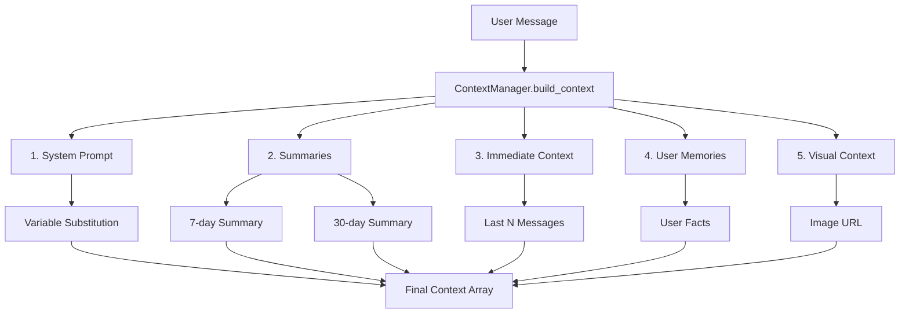
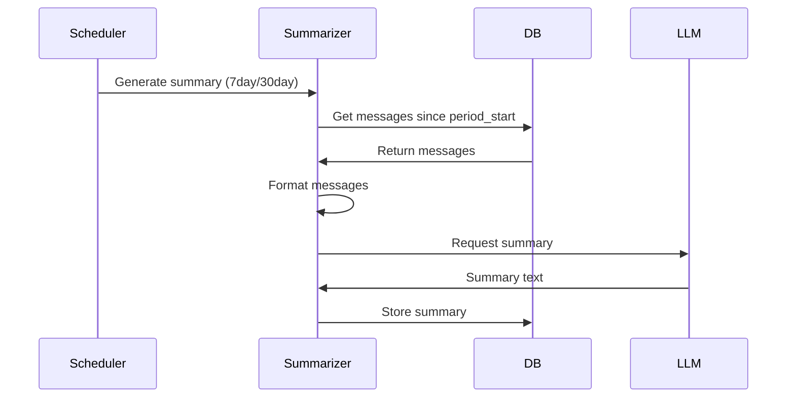

# Керування контекстом

Цей документ надає поглиблений розгляд системи керування контекстом, пояснюючи, як бот збирає контекст для запитів LLM, керує історією розмов та підтримує пам'ять користувачів.

## Огляд

Система керування контекстом відповідає за збір комплексного контексту для кожного запиту LLM. Вона поєднує кілька джерел інформації, щоб надати LLM релевантний фон, історію розмов та дані користувача.

## Процес збірки контексту

Контекст збирається в певному порядку:



## Шари контексту

### 1. Системний промпт

Системний промпт надає базові інструкції та особистість для бота.

**Розташування:** `bot/context/permanent.py`

**Особливості:**
- Завантажується з markdown файлів у директорії `prompts/`
- Підстановка змінних для динамічного контенту
- Налаштовується через параметр `SYSTEM_PROMPT_FILE`

**Доступні змінні:**
- `{chatname}` - Назва чату або "Приватний чат"
- `{chatid}` - Telegram chat ID
- `{chattype}` - Тип чату (private, group, supergroup)
- `{username}` - Ім'я користувача (з @)
- `{userfullname}` - Повне ім'я користувача
- `{userid}` - Telegram ID користувача
- `{timestamp}` - Поточний час
- `{date}` - Поточна дата
- `{time}` - Поточний час
- `{botname}` - Відображуване ім'я бота
- `{botusername}` - Ім'я користувача бота
- `{membercount}` - Кількість учасників групи
- `{tools}` - Список доступних інструментів
- `{user_memories}` - Збережені спогади користувача
- `{user_pronouns}` - Займенники користувача (якщо встановлено)

**Конфігурація:**

```env
SYSTEM_PROMPT_FILE=default.md  # або assistant.md, casual.md
```

### 2. Підсумки

Підсумки надають стиснений контекст для старіших розмов, зменшуючи використання токенів, зберігаючи важливу інформацію.

**Розташування:** `bot/context/summarizer.py`

**Типи:**

1. **7-денний підсумок** (Недавній)
   - За замовчуванням: 1024 токени
   - Генерується кожні 3 дні
   - Охоплює останні 7 днів розмови
   - Конфігурація: `RECENT_SUMMARY_TOKENS`, `RECENT_SUMMARY_INTERVAL_DAYS`

2. **30-денний підсумок** (Довгостроковий)
   - За замовчуванням: 4096 токенів
   - Генерується кожні 14 днів
   - Охоплює останні 30 днів розмови
   - Конфігурація: `LONG_SUMMARY_TOKENS`, `LONG_SUMMARY_INTERVAL_DAYS`

**Процес генерації:**



**Конфігурація:**

```env
RECENT_SUMMARY_TOKENS=1024
RECENT_SUMMARY_INTERVAL_DAYS=3
LONG_SUMMARY_TOKENS=4096
LONG_SUMMARY_INTERVAL_DAYS=14
```

### 3. Негайний контекст

Негайний контекст включає найновіші повідомлення в розмові.

**Розташування:** `bot/context/manager.py` (в `_get_immediate_context_text()`)

**Особливості:**
- Останні N повідомлень (за замовчуванням: 100)
- Форматовані з іменами користувачів та ланцюгами відповідей
- Включає відповіді бота
- Хронологічний порядок (від найстарішого до найновішого)

**Формат:**

```
[Ім'я користувача (@username, id:123)]: Текст повідомлення
[Ім'я користувача (@username, id:123)] (відповідь на: "Попереднє повідомлення"): Текст відповіді
[Ім'я бота]: Відповідь бота
```

**Конфігурація:**

```env
IMMEDIATE_CONTEXT_MESSAGES=100  # 10-500
```

### 4. Пам'ять користувача

Пам'ять користувача - це персистентні факти про користувачів, які зберігаються в усіх чатах.

**Розташування:** `bot/db/repositories/memories.py`

**Особливості:**
- Глобальна пам'ять (працює в усіх чатах)
- Максимум 50 фактів на користувача (налаштовується)
- Автоматично очищається при досягненні ліміту (найстаріші видаляються)
- Включається в системний промпт

**Формат в контексті:**

```
- Користувач любить програмування на Python
- Користувач живе в Києві
- Улюблений колір користувача - синій
```

**Керування:**

Пам'ять керується через інструменти:
- `save_user_fact` - Зберегти факт
- `get_user_facts` - Отримати всі факти

Також доступно через команду користувача `/memories`, яка відображає спогади з пагінацією.

**Конфігурація:**

```env
USER_MEMORY_MAX_FACTS=50  # 10-100
```

### 5. Візуальний контекст

Візуальний контекст додається при відповіді на зображення.

**Розташування:** `bot/context/manager.py` (в `build_context()`)

**Процес:**

1. Перевірити, чи повідомлення є відповіддю на зображення
2. Витягти файл зображення з Telegram
3. Створити доступну URL
4. Додати до контексту як мультимодальне повідомлення

**Вимоги:**

- `LLM_VISION_ENABLED=True`
- Модель з підтримкою зору (наприклад, GPT-4 Vision)
- Відповідь на повідомлення з фото

## Реалізація збірки контексту

### Клас ContextManager

Клас `ContextManager` оркеструє збірку контексту:

```python
from bot.context.manager import ContextManager

context_manager = ContextManager(
    chat_id=chat_id,
    user_id=user_id,
    bot=bot,
    reply_to_message=message.reply_to_message,
    chat_title="Мій чат",
    chat_type="private"
)

context = await context_manager.build_context()
```

**Метод: `build_context()`**

Збирає повний контекст:

1. Завантажити системний промпт зі змінними
2. Отримати підсумки (7-денний та 30-денний)
3. Отримати негайний контекст (останні N повідомлень)
4. Додати пам'ять користувача до системного промпту
5. Додати візуальний контекст, якщо відповідаємо на зображення
6. Повернути список словників повідомлень

## Керування токенами

### Ліміти токенів

Система керує використанням токенів через кілька лімітів:

1. **Макс. токени контексту** (`CONTEXT_MAX_TOKENS`)
   - За замовчуванням: 8000
   - Максимальна кількість токенів для всього контексту
   - Діапазон: 2000-128000

2. **Макс. токени відповіді** (`LLM_MAX_RESPONSE_TOKENS`)
   - За замовчуванням: 2048
   - Максимальна кількість токенів у відповіді LLM
   - Діапазон: 256-16384

3. **Токени підсумків**
   - Недавній: 1024 (за замовчуванням)
   - Довгостроковий: 4096 (за замовчуванням)

## Стратегія сумаризації

### Коли генеруються підсумки

Підсумки генеруються фоновим планувальником:

1. **7-денний підсумок:**
   - Генерується кожні 3 дні (налаштовується)
   - Охоплює останні 7 днів
   - Замінює попередній 7-денний підсумок

2. **30-денний підсумок:**
   - Генерується кожні 14 днів (налаштовується)
   - Охоплює останні 30 днів
   - Замінює попередній 30-денний підсумок

## Система пам'яті

### Як працює пам'ять

1. **Зберігання:**
   - Спогади зберігаються глобально (в усіх чатах)
   - Максимум 50 на користувача (налаштовується)
   - Найстаріші спогади видаляються при досягненні ліміту

2. **Отримання:**
   - Всі спогади користувача завантажуються в системний промпт
   - Формат: Маркований список фактів
   - Доступні в усіх розмовах

3. **Керування:**
   - Створюються через інструмент `save_user_fact`
   - Отримуються через інструмент `get_user_facts`
   - Також доступні через команду `/memories`
   - Автоматично очищаються при досягненні ліміту

## Оптимізація контексту

### Зменшення використання токенів

1. **Зменшити негайний контекст:**
   ```env
   IMMEDIATE_CONTEXT_MESSAGES=50  # Замість 100
   ```

2. **Зменшити токени підсумків:**
   ```env
   RECENT_SUMMARY_TOKENS=512
   LONG_SUMMARY_TOKENS=2048
   ```

3. **Більш часті підсумки:**
   ```env
   RECENT_SUMMARY_INTERVAL_DAYS=1  # Більш часто
   ```

### Збільшення контексту

1. **Збільшити негайний контекст:**
   ```env
   IMMEDIATE_CONTEXT_MESSAGES=200
   ```

2. **Збільшити ліміт контексту:**
   ```env
   CONTEXT_MAX_TOKENS=16000
   ```

## Усунення проблем контексту

### Проблема: Контекст занадто великий

**Симптоми:** Помилки перевищення `context_max_tokens`

**Рішення:**
1. Зменшити `IMMEDIATE_CONTEXT_MESSAGES`
2. Зменшити ліміти токенів підсумків
3. Увімкнути більш часті підсумки
4. Зменшити `CONTEXT_MAX_TOKENS` (якщо прийнятно)

### Проблема: Відсутній контекст

**Симптоми:** Бот не пам'ятає недавні розмови

**Рішення:**
1. Збільшити `IMMEDIATE_CONTEXT_MESSAGES`
2. Перевірити, що підсумки генеруються
3. Перевірити, що база даних має повідомлення
4. Перевірити розклад генерації підсумків

## Пов'язана документація

- [Архітектура](architecture.md) - Огляд архітектури системи
- [Конфігурація](configuration.md) - Опції конфігурації контексту
- [Схема бази даних](database.md) - Моделі бази даних для контексту
