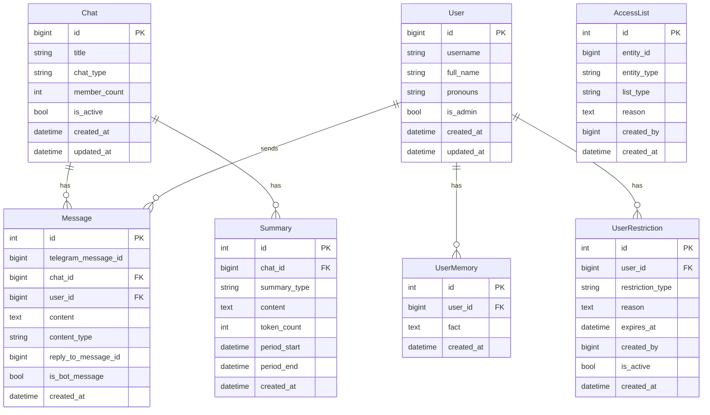

# Схема бази даних

Цей документ надає повну документацію схеми бази даних, включаючи зв'язки сутностей, структури таблиць та патерни використання.

## Огляд

Бот використовує PostgreSQL як основну базу даних, керується через SQLAlchemy 2.0 ORM та міграції Alembic. Всі операції з базою даних є асинхронними, використовуючи драйвер `asyncpg`.

## Діаграма зв'язків сутностей



## Таблиці

### Chat

Зберігає метадані та налаштування Telegram чатів.

**Таблиця:** `chats`

**Колонки:**

| Колонка | Тип | Опис | Обмеження |
|--------|------|-------------|-------------|
| `id` | `BIGINT` | Telegram chat ID | PRIMARY KEY |
| `title` | `VARCHAR(255)` | Назва чату | NULLABLE |
| `chat_type` | `VARCHAR(20)` | Тип чату | NOT NULL |
| `member_count` | `INT` | Кількість учасників | NULLABLE |
| `is_active` | `BOOLEAN` | Чи активний чат | DEFAULT TRUE |
| `created_at` | `TIMESTAMP` | Час створення | DEFAULT NOW() |
| `updated_at` | `TIMESTAMP` | Час останнього оновлення | DEFAULT NOW(), ON UPDATE |

### User

Зберігає інформацію та налаштування користувачів Telegram.

**Таблиця:** `users`

**Колонки:**

| Колонка | Тип | Опис | Обмеження |
|--------|------|-------------|-------------|
| `id` | `BIGINT` | Telegram user ID | PRIMARY KEY |
| `username` | `VARCHAR(255)` | Ім'я користувача Telegram | NULLABLE |
| `full_name` | `VARCHAR(255)` | Повне ім'я користувача | NOT NULL |
| `pronouns` | `VARCHAR(50)` | Займенники користувача | NULLABLE |
| `is_admin` | `BOOLEAN` | Чи є користувач адміном | DEFAULT FALSE |
| `created_at` | `TIMESTAMP` | Час створення | DEFAULT NOW() |
| `updated_at` | `TIMESTAMP` | Час останнього оновлення | DEFAULT NOW(), ON UPDATE |

### Message

Зберігає всі повідомлення для керування контекстом.

**Таблиця:** `messages`

**Колонки:**

| Колонка | Тип | Опис | Обмеження |
|--------|------|-------------|-------------|
| `id` | `INT` | Внутрішній ID повідомлення | PRIMARY KEY, AUTO_INCREMENT |
| `telegram_message_id` | `BIGINT` | Telegram message ID | NOT NULL |
| `chat_id` | `BIGINT` | Chat ID | FOREIGN KEY, NOT NULL |
| `user_id` | `BIGINT` | User ID | FOREIGN KEY, NULLABLE |
| `content` | `TEXT` | Вміст повідомлення | NOT NULL |
| `content_type` | `VARCHAR(50)` | Тип контенту | DEFAULT 'text' |
| `reply_to_message_id` | `BIGINT` | Telegram ID відповіді | NULLABLE |
| `is_bot_message` | `BOOLEAN` | Чи від бота | DEFAULT FALSE |
| `created_at` | `TIMESTAMP` | Час створення | DEFAULT NOW() |

### Summary

Зберігає згенеровані підсумки контексту.

**Таблиця:** `summaries`

**Колонки:**

| Колонка | Тип | Опис | Обмеження |
|--------|------|-------------|-------------|
| `id` | `INT` | Summary ID | PRIMARY KEY, AUTO_INCREMENT |
| `chat_id` | `BIGINT` | Chat ID | FOREIGN KEY, NOT NULL |
| `summary_type` | `VARCHAR(20)` | Тип підсумку (7day, 30day) | NOT NULL |
| `content` | `TEXT` | Вміст підсумку | NOT NULL |
| `token_count` | `INT` | Оцінка кількості токенів | NOT NULL |
| `period_start` | `TIMESTAMP` | Початок періоду | NOT NULL |
| `period_end` | `TIMESTAMP` | Кінець періоду | NOT NULL |
| `created_at` | `TIMESTAMP` | Час створення | DEFAULT NOW() |

### UserMemory

Зберігає персистентні факти про користувачів.

**Таблиця:** `user_memories`

**Колонки:**

| Колонка | Тип | Опис | Обмеження |
|--------|------|-------------|-------------|
| `id` | `INT` | Memory ID | PRIMARY KEY, AUTO_INCREMENT |
| `user_id` | `BIGINT` | User ID | FOREIGN KEY, NOT NULL |
| `fact` | `TEXT` | Факт для запам'ятовування | NOT NULL |
| `created_at` | `TIMESTAMP` | Час створення | DEFAULT NOW() |

### UserRestriction

Зберігає бани та обмеження на рівні бота.

**Таблиця:** `user_restrictions`

**Колонки:**

| Колонка | Тип | Опис | Обмеження |
|--------|------|-------------|-------------|
| `id` | `INT` | Restriction ID | PRIMARY KEY, AUTO_INCREMENT |
| `user_id` | `BIGINT` | User ID | FOREIGN KEY, NOT NULL |
| `restriction_type` | `VARCHAR(20)` | Тип (ban, restrict) | NOT NULL |
| `reason` | `TEXT` | Причина обмеження | NULLABLE |
| `expires_at` | `TIMESTAMP` | Час закінчення | NULLABLE (NULL = постійно) |
| `created_by` | `BIGINT` | Адмін, що створив | NOT NULL |
| `is_active` | `BOOLEAN` | Чи активне обмеження | DEFAULT TRUE |
| `created_at` | `TIMESTAMP` | Час створення | DEFAULT NOW() |

## Патерн Repository

Весь доступ до бази даних проходить через класи репозиторіїв, розташовані в `bot/db/repositories/`.

### Доступні репозиторії

- `ChatRepository` - Операції з чатами
- `UserRepository` - Операції з користувачами
- `MessageRepository` - Операції з повідомленнями
- `SummaryRepository` - Операції з підсумками
- `MemoryRepository` - Операції з пам'яттю

## Міграції бази даних

Міграції керуються за допомогою Alembic.

### Створення міграцій

```bash
# Автогенерація зі змін моделей
alembic revision --autogenerate -m "Опис"

# Ручна міграція
alembic revision -m "Опис"
```

### Застосування міграцій

```bash
# Застосувати всі очікувані міграції
alembic upgrade head

# Застосувати конкретну міграцію
alembic upgrade <revision>

# Відкотити одну міграцію
alembic downgrade -1
```

## Оптимізація запитів

### Індекси

Ключові індекси для продуктивності:

1. **Messages:**
   - `(chat_id, created_at)` - Для запитів останніх повідомлень
   - `(chat_id, telegram_message_id)` - Для пошуку повідомлень

2. **Summaries:**
   - `(chat_id, summary_type)` - Для запитів останніх підсумків

3. **User Memories:**
   - `user_id` - Для запитів пам'яті користувача

## Резервне копіювання та відновлення

### Резервне копіювання

```bash
# Повне резервне копіювання бази даних
pg_dump -U bot gryag > backup.sql

# Зі стисненням
pg_dump -U bot gryag | gzip > backup.sql.gz
```

### Відновлення

```bash
# Відновити з резервної копії
psql -U bot gryag < backup.sql

# Зі стисненої резервної копії
gunzip < backup.sql.gz | psql -U bot gryag
```

## Пов'язана документація

- [Архітектура](architecture.md) - Архітектура системи
- [Розгортання](deployment.md) - Посібник з розгортання та міграцій
