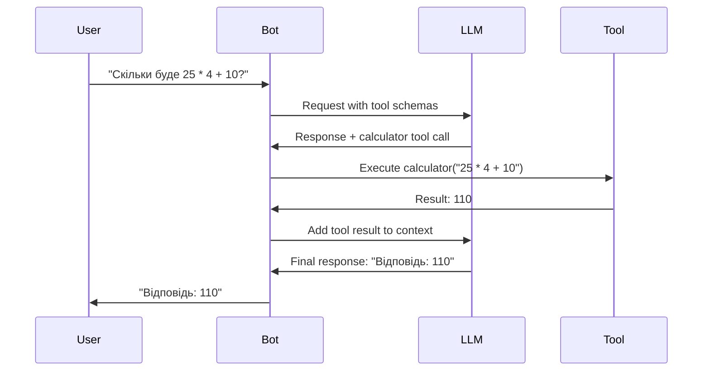

# Інструменти

Бот Гряг підтримує розширення функціоналу через виклик інструментів, які ШІ може викликати за потреби. Інструменти дозволяють боту виконувати дії за межами генерації тексту, такі як обчислення, веб-пошук та отримання даних.

## Як працює виклик інструментів

Бот використовує ітеративний цикл виклику інструментів:



**Процес:**
1. Користувач надсилає повідомлення
2. Бот збирає контекст і надсилає LLM з доступними схемами інструментів
3. LLM аналізує запит і вирішує, чи потрібен інструмент
4. Якщо потрібен, LLM генерує запит на виклик інструменту
5. Бот виконує інструмент і повертає результат LLM
6. LLM формулює остаточну відповідь на основі результату інструменту
7. Бот надсилає відповідь користувачу

**Ітеративний цикл:** Бот може зробити до 5 викликів інструментів послідовно, якщо потрібно (наприклад, пошук у веб → обчислення → форматування відповіді).

## Доступні інструменти

### 1. Калькулятор (`calculator`)

Безпечно обчислює математичні вирази, використовуючи парсинг AST (без `eval()`).

**Можливості:**
- Базові арифметичні операції: `+`, `-`, `*`, `/`
- Піднесення до степеня: `**`
- Цілочисельне ділення: `//`
- Модуло: `%`
- Дужки: `( )`
- Унарні оператори: `+`, `-`

**Параметри:**
- `expression` (string, обов'язково): Математичний вираз

**Приклади:**
- "Обчисли (25 * 4) / 5"
- "Скільки буде 2^10?"
- "Обчисли 100 + 50 - 30"

**Безпека:**
- Використовує парсинг Python AST (Abstract Syntax Tree)
- Дозволяє тільки безпечні математичні операції
- Немає виконання коду або викликів функцій
- Немає доступу до системних функцій

**Реалізація:** `bot/tools/calculator.py`

### 2. Погода (`weather`)

Надає актуальну інформацію про погоду для будь-якої локації у всьому світі, використовуючи Open-Meteo API (безкоштовно, без API ключа).

**Можливості:**
- Поточна температура
- Температура "відчувається як"
- Погодні умови (сонячно, хмарно, дощ тощо)
- Відсоток вологості
- Швидкість вітру
- Кількість опадів

**Параметри:**
- `location` (string, обов'язково): Назва міста або локація (наприклад, "Київ", "London, UK", "New York")

**Приклади:**
- "Яка зараз погода в Києві?"
- "Перевір погоду для Лондона"
- "Яка погода в Нью-Йорку?"

**Джерело даних:** [Open-Meteo API](https://open-meteo.com/) - Безкоштовний API погоди

**Реалізація:** `bot/tools/weather.py`

### 3. Веб-пошук (`search_web`)

Шукає в інтернеті актуальну інформацію, новини та факти, використовуючи DuckDuckGo.

**Можливості:**
- Пошук в реальному часі
- Кілька результатів (налаштовується)
- Заголовок, опис та URL для кожного результату
- API ключ не потрібен

**Параметри:**
- `query` (string, обов'язково): Пошуковий запит
- `max_results` (integer, опціонально): Максимальна кількість результатів (за замовчуванням: 5, макс: 10)

**Приклади:**
- "Знайди останні новини про ШІ"
- "Знайди інформацію про Python 3.13"
- "Що сталося в Україні сьогодні?"

**Джерело даних:** DuckDuckGo Search API (через бібліотеку `ddgs`)

**Реалізація:** `bot/tools/search.py`

### 4. Генерація зображень (`generate_image`)

Генерує зображення, використовуючи DALL-E 3 (або сумісний API генерації зображень).

**Можливості:**
- Генерація зображень з тексту
- Високоякісні зображення (1024x1024)
- Підтримка детальних промптів

**Параметри:**
- `prompt` (string, обов'язково): Детальний опис зображення для генерації
- `size` (string, опціонально): Розмір зображення (за замовчуванням: "1024x1024")

**Приклади:**
- "Згенеруй зображення заходу сонця над горами"
- "Створи картинку робота, що читає книгу"
- "Зроби зображення футуристичного міста"

**Вимоги:**
- `IMAGE_GENERATION_ENABLED=True` в конфігурації
- Валідний API ключ з доступом до генерації зображень
- Використовує той самий API endpoint, що й LLM (або окремий, якщо налаштовано)

**Реалізація:** `bot/tools/image.py`

### 5. Зберегти факт (`save_user_fact`)

Зберігає персистентний факт про користувача, який буде пам'ятатися в усіх чатах.

**Можливості:**
- Глобальна пам'ять (працює в усіх чатах)
- Максимум 50 фактів на користувача (налаштовується)
- Автоматичне очищення найстаріших спогадів при досягненні ліміту
- Використовується в системному промпті для контексту

**Параметри:**
- `fact` (string, обов'язково): Факт для збереження (наприклад, "Користувач любить котів", "Користувач живе в Києві")

**Приклади:**
- Користувач: "Я люблю програмувати на Python"
  - Бот викликає: `save_user_fact(fact="Користувач любить програмувати на Python")`
- Користувач: "Мій улюблений колір - синій"
  - Бот викликає: `save_user_fact(fact="Улюблений колір користувача - синій")`

**Зберігання:** База даних PostgreSQL (таблиця `user_memories`)

**Реалізація:** `bot/tools/memory.py`

**Примітка:** User ID автоматично вводиться обробниками при виклику цього інструменту.

### 6. Отримати факти (`get_user_facts`)

Отримує всі збережені факти про користувача.

**Можливості:**
- Повертає всі факти користувача
- Опціональний пошук/фільтрація
- Відформатований список виводу

**Параметри:**
- `query` (string, опціонально): Опціональний пошуковий запит для фільтрації фактів

**Приклади:**
- Бот викликає: `get_user_facts()` - Повертає всі факти
- Бот викликає: `get_user_facts(query="колір")` - Повертає факти, що містять "колір"

**Випадки використання:**
- Коли користувач питає "Що ти знаєш про мене?"
- Коли боту потрібно посилатися на уподобання користувача
- Для контексту в розмовах

**Реалізація:** `bot/tools/memory.py`

**Примітка:** User ID автоматично вводиться обробниками при виклику цього інструменту.

## Реєстр інструментів

Всі інструменти реєструються в `ToolRegistry` (`bot/tools/registry.py`):

- **Автоматичне виявлення**: Інструменти автоматично реєструються при запуску
- **Генерація схем**: Конвертує інструменти у формат виклику функцій OpenAI
- **Обробка помилок**: Перехоплює та повідомляє про помилки виконання інструментів
- **Виконання**: Асинхронне виконання інструментів з обробкою результатів

### Реєстрація інструментів

Інструменти реєструються в `bot/tools/registry.py`:

```python
def _register_default_tools(registry: ToolRegistry) -> None:
    registry.register(CalculatorTool())
    registry.register(WeatherTool())
    registry.register(SearchTool())
    registry.register(GenerateImageTool())
    registry.register(SaveUserFactTool())
    registry.register(GetUserFactsTool())
```

## Створення власних інструментів

### Інтерфейс інструменту

Всі інструменти повинні реалізувати інтерфейс `BaseTool`:

```python
from bot.tools.base import BaseTool, ToolResult

class MyCustomTool(BaseTool):
    name = "my_tool"
    description = "Опис того, що робить інструмент"
    parameters = {
        "type": "object",
        "properties": {
            "param1": {
                "type": "string",
                "description": "Опис параметра"
            }
        },
        "required": ["param1"]
    }
    
    async def execute(self, param1: str, **kwargs) -> ToolResult:
        try:
            # Логіка інструменту тут
            result = do_something(param1)
            return ToolResult(
                success=True,
                output=f"Результат: {result}",
                data={"result": result}
            )
        except Exception as e:
            return ToolResult(
                success=False,
                output="",
                error=str(e)
            )
```

### ToolResult

Інструменти повертають об'єкт `ToolResult`:

- `success` (bool): Чи виконання успішне
- `output` (str): Зрозумілий для людини вивід для LLM
- `data` (dict): Структуровані дані (опціонально)
- `error` (str): Повідомлення про помилку, якщо не вдалося

### Реєстрація вашого інструменту

1. **Створіть файл інструменту** в `bot/tools/`:
   ```python
   # bot/tools/mytool.py
   from bot.tools.base import BaseTool, ToolResult
   
   class MyTool(BaseTool):
       # ... реалізація
   ```

2. **Зареєструйте в реєстрі** (`bot/tools/registry.py`):
   ```python
   from bot.tools.mytool import MyTool
   
   def _register_default_tools(registry: ToolRegistry) -> None:
       # ... існуючі інструменти
       registry.register(MyTool())
   ```

3. **Перезапустіть бота** для завантаження нового інструменту

### Найкращі практики

1. **Обробка помилок:**
   - Завжди перехоплюйте винятки
   - Повертайте зрозумілі повідомлення про помилки
   - Логуйте помилки для налагодження

2. **Валідація вводу:**
   - Валідуйте параметри в методі `execute()`
   - Використовуйте підказки типів для ясності
   - Надавайте чіткі повідомлення про помилки

3. **Асинхронні операції:**
   - Використовуйте `async/await` для операцій I/O
   - Не блокуйте цикл подій
   - Використовуйте таймаути для зовнішніх API викликів

4. **Документація:**
   - Чіткий `description` для розуміння LLM
   - Детальні описи параметрів
   - Включайте приклади в docstrings

5. **Безпека:**
   - Валідуйте всі входи
   - Очищайте виходи
   - Не виконуйте довільний код
   - Використовуйте безпечні API та бібліотеки

### Приклад: Власний інструмент

```python
"""Приклад власного інструменту для отримання інформації про користувача."""

import httpx
from bot.tools.base import BaseTool, ToolResult

class UserInfoTool(BaseTool):
    """Отримати інформацію про користувача з API."""
    
    name = "get_user_info"
    description = "Отримати інформацію про користувача за ім'ям користувача з зовнішнього API"
    parameters = {
        "type": "object",
        "properties": {
            "username": {
                "type": "string",
                "description": "Ім'я користувача для пошуку"
            }
        },
        "required": ["username"]
    }
    
    async def execute(self, username: str, **kwargs) -> ToolResult:
        """Виконати пошук інформації про користувача."""
        try:
            async with httpx.AsyncClient(timeout=10.0) as client:
                response = await client.get(
                    f"https://api.example.com/users/{username}"
                )
                response.raise_for_status()
                data = response.json()
                
                return ToolResult(
                    success=True,
                    output=f"Користувач {username}: {data.get('name', 'Невідомо')}",
                    data=data
                )
        except httpx.HTTPError as e:
            return ToolResult(
                success=False,
                output="",
                error=f"Помилка API: {e}"
            )
        except Exception as e:
            return ToolResult(
                success=False,
                output="",
                error=f"Неочікувана помилка: {e}"
            )
```

## Робочий процес виклику інструментів

### Одиночний виклик інструменту

```
Користувач: "Скільки буде 2 + 2?"
→ LLM: Викликає calculator("2 + 2")
→ Інструмент: Повертає "2 + 2 = 4"
→ LLM: "Відповідь: 4"
```

### Множинні виклики інструментів

```
Користувач: "Яка погода в Києві та обчисли 10 * 5?"
→ LLM: Викликає weather("Kyiv") та calculator("10 * 5")
→ Інструменти: Повертають дані про погоду та результат обчислення
→ LLM: Об'єднує результати в остаточну відповідь
```

### Ітеративні виклики інструментів

```
Користувач: "Знайди функції Python 3.13 та підсумуй"
→ LLM: Викликає search_web("Python 3.13 features")
→ Інструмент: Повертає результати пошуку
→ LLM: Аналізує результати та генерує підсумок
→ Бот: Надсилає підсумок користувачу
```

## Мультимодальність (Зір)

Хоча це не окремий "інструмент", бот підтримує розпізнавання зображень:

**Можливості:**
- Аналіз зображень через моделі зору
- Відповідь на зображення текстовими питаннями
- Автоматичне витягування URL зображень з Telegram

**Використання:**
1. Надішліть фото боту
2. Відповідайте на фото питанням (наприклад, "Що на цьому зображенні?")
3. Бот аналізує зображення та відповідає

**Конфігурація:**
- `LLM_VISION_ENABLED=True` (обов'язково)
- `LLM_VISION_MODEL` (або використовує `LLM_MODEL`)
- Потрібна модель з підтримкою зору (наприклад, GPT-4 Vision, Claude 3)

**Реалізація:** Обробка зображень в `bot/context/manager.py` та `bot/handlers/private.py`

## Обмеження інструментів

1. **Ліміти частоти**: Зовнішні API можуть мати ліміти частоти
2. **Таймаут**: Інструменти повинні завершуватися за розумний час
3. **Обробка помилок**: Інструменти повинні елегантно обробляти збої
4. **Ліміти токенів**: Результати інструментів враховуються в лімітах контексту
5. **Ліміт ітерацій**: Максимум 5 викликів інструментів на запит

## Налагодження інструментів

### Перегляд доступних інструментів

Використовуйте адмін-команду `/config` для перегляду конфігурації інструментів.

### Логування виконання інструментів

Виконання інструментів логується на рівні INFO:
```
INFO: Executing tool calculator with args: {'expression': '2+2'}
```

### Тестування інструментів вручну

Ви можете тестувати інструменти в Python:

```python
from bot.tools.registry import get_registry

registry = get_registry()
result = await registry.execute("calculator", expression="2+2")
print(result.output)
```

## Пов'язана документація

- [Архітектура](architecture.md) - Архітектура системи, включаючи систему інструментів
- [API Reference](api-reference.md) - Базові класи та інтерфейси інструментів
- [Посібник з розробки](development.md) - Посібник з додавання нових функцій
